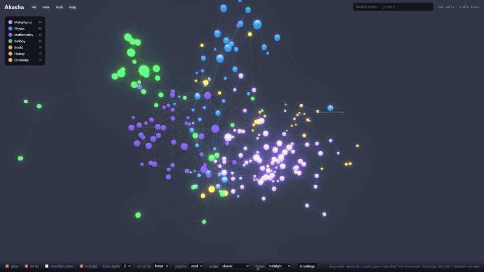

<div align="center">
<pre>
SINAPSO
</pre>

**an immersive 3D environment for the Markdown knowledge world you own**

*See and create connections, find knowledge gaps, and turn grounded work into durable files.*
</div>

<p align="center">
  
</p>

Sinapso turns a folder of linked Markdown into a spatial graph with a research
and editing workspace beside it. Move through notes and clusters, follow or
create links, inspect unresolved links, orphans, and sparse areas, and develop
useful findings without leaving the knowledge world that provides their context.

When configured, Sinapso's real-time voice assistant acts through
registry-derived interface tools. Within those current limits, it can navigate,
discover, read, research, and work with documents. It is not a generic chatbot
over a separate corpus: its tools operate against the current vault and
workspace, while durable promotion still passes through the Inbox or reviewed,
guarded wiki operations. Markdown and YAML files remain the source of truth.

## The experience

- **Spatial graph:** see notes, clusters, structural links, semantic
  relationships, and gaps as a navigable three-dimensional environment.
- **Research and editing workspace:** keep the selected note beside local
  discovery, optional Web research, ingestion results, and editable working
  documents.
- **Context-aware assistant:** configured real-time voice sessions use the same
  registry-derived tools to act on the interface within the verified navigation,
  discovery, reading, research, and document-working limits above.
- **Safe durable promotion:** capture work to `inbox/`, or review proposed wiki
  creates, edits, and raw copies before Sinapso applies approved operations
  through its guarded writer.

## The workflow

1. **Explore.** Scan linked Markdown, move through clusters, search notes, and
   follow wiki or relative Markdown links.
2. **Find what is missing.** Inspect unresolved links, orphans, sparse areas,
   and optional local semantic neighbors.
3. **Investigate and write.** Keep the current note beside research results,
   edit Markdown directly, or develop a working document with the configured
   assistant.
4. **Promote deliberately.** Save capture-only work to `inbox/`, or approve
   contract-aware wiki operations before any durable write.

An Obsidian vault is a natural input, but Obsidian is optional. Sinapso also
works with any folder of linked Markdown and with Open Knowledge Format bundles.

## Flythrough

<p align="center">
  
</p>

*Orbit the graph, move into a cluster, and open a note without leaving the
workspace. [Watch in HD (mp4).](assets/flythrough.mp4)*

## What Sinapso reads

The scanner understands both common Markdown link styles:

- Obsidian `[[wiki links]]`, resolved by basename or vault-relative path
- Standard links to Markdown files, such as `[text](folder/note.md)`, resolved
  relative to the source note

YAML frontmatter can provide `title`, `type`, `tags`, and `description`. Folder
structure, tags, structural links, and optional local semantic relationships
drive the graph's layout, grouping, and discovery tools.

### Open Knowledge Format

Point Sinapso at an
[Open Knowledge Format](https://cloud.google.com/blog/products/data-analytics/how-the-open-knowledge-format-can-improve-data-sharing/)
bundle and it is scanned like any other linked Markdown folder:

```bash
npx sinapso "C:/path/to/okf-bundle"
```

Concept files become nodes, Markdown links become edges, and supported
frontmatter is carried into the graph.

## Core capabilities

### Discover and navigate

- **Spatial graph:** drag to rotate, scroll to zoom, right-drag to pan, or use
  arrow keys to move the camera.
- **Search and fly:** press `/`, search note titles and content, and open the
  selected result in context.
- **Focus mode:** dim everything outside a selected note's depth 1 to 3
  neighborhood.
- **Filters:** order `show` and `ignore` rules matched against titles, tags,
  and folders by fuzzy text or wildcard.
- **Grouping:** color and group nodes by folder, tag, or optional semantic
  cluster.
- **Graph gaps:** inspect unresolved links, orphans, and sparse areas. Phantom
  nodes represent linked notes that do not exist yet.
- **View controls:** switch arrangement, theme, node style, graphics tier,
  labels, glow, unwritten notes, orphans, and semantic lines.

### Read, edit, and link

- **Always-editable Markdown:** clicking a note opens a CodeMirror live-preview
  editor in a dockable, resizable pane.
- **Wikilinks:** existing links are navigable, and typing `[[` opens local
  vault autocomplete.
- **Guarded autosave:** edits use a base-content hash, surface stale-file
  conflicts, preserve an unload recovery mirror, and pass through the single
  path-confined writer.
- **Live graph updates:** changing a wiki or relative Markdown link rescans the
  affected structure and updates the graph without discarding a successful
  file save.
- **Git note history:** Git-backed vaults can show earlier versions, preview
  them read-only, and restore the selected note through the guarded writer.
- **Obsidian handoff:** double-click or right-click a note to open it through
  the optional `obsidian://` URI.

### Research and durable documents

- **Shared research space:** keyword, semantic, Web, article, and ingestion
  results open in one right-side column while the current note remains visible.
- **Research history:** reopen prior results and working documents from local
  runtime history.
- **Editable working documents:** create or update a research document across
  turns, with autosave and explicit conflict actions.
- **Inbox:** capture useful sources or research as Markdown in `inbox/`, then
  edit them with the same note workflow.
- **Wiki promotion:** select an enabled wiki, review contract-aware operations,
  and apply only the approved creates, edits, or raw copies.

### Assistant and local access surfaces

- **Web and desktop:** use the same workspace in a browser or Electron shell.
- **CLI:** the `sinapso` command scans and serves a vault; registry-backed calls
  reach the same loopback product routes.
- **MCP:** `npm run mcp` starts a stdio MCP server for compatible local clients.
  Tool calls are proxied to the running Sinapso server with a surface-scoped
  token. See [Connecting MCP clients](docs/mcp-clients.md).
- **Real-time voice assistant:** configured Gemini, OpenAI, or xAI real-time
  sessions can act through the shared registry-derived tools to navigate,
  discover, read, research, and work with documents.

## Appearance and scale

Ten themes restyle the scene and interface. Four node styles control how notes
are drawn: **classic**, **dodecahedron**, **starlight**, and **particle**. The
scanner caches unchanged parses, settled layouts are associated with a graph
fingerprint, and render budgets keep links and labels practical as vaults grow.

<p align="center">
  
</p>

## Quickstart

```bash
npx sinapso "/path/to/vault"     # scan, serve, and open
```

Or from a clone:

```bash
npm install
npm run scan -- "/path/to/vault" --exclude "Private/Drafts"
npm run build
npm start                         # http://localhost:5175
```

For development with hot reload, run `npm run dev` and open
http://localhost:5173.

### Desktop app

```bash
npm run desktop
```

This builds the frontend, starts the loopback server, and opens the Electron
shell. **File > Open Vault...** (`Ctrl/Cmd+Shift+O`) selects and scans a local
folder. **Rescan Current Vault** (`Ctrl/Cmd+Shift+R`) refreshes the graph after
files change.

## Controls

| Input | Action |
|-------|--------|
| Left-drag | Rotate |
| Scroll | Zoom |
| Right-drag | Pan |
| Arrow keys | Fly forward, back, or sideways |
| `Shift` + arrows | Pan |
| `+` / `-` | Zoom |
| `F` | Toggle fullscreen |
| `R` | Reset camera |
| `G` / `L` / `U` / `O` | Toggle glow / labels / unwritten / orphans |
| `Ctrl/Cmd` + `C` | Copy a local view link to the selected note |
| `Ctrl/Cmd` + `O` | Open the selected note in Obsidian |
| Hover | Highlight a node and its neighbors |
| Click | Select, fly to, and edit a note |
| Double-click / right-click | Open the note in Obsidian |
| `/` | Focus search |
| `Esc` | Close a modal or menu, then clear selection |

## Optional integrations

Sinapso's core scanning, graph, reading, editing, keyword search, and Inbox do
not require an external service. Optional integrations are detected or
configured independently.

Three mutually exclusive mode buttons sit beside the search field. The active
mode changes what Enter does, and results open in the shared research column.

| Mode | Tool | Behavior |
|------|------|----------|
| **Semantic** | [qmd](https://github.com/tobi/qmd), local | Searches local note meaning and supplies related-note and semantic-graph features. qmd's SQLite index is opened read-only. |
| **Web** | [Exa](https://exa.ai), user key | Runs an explicit web-research request after consent. It never spends credit while the user is only typing. |
| **Ingest** | markitdown, plus an optional model key for wiki synthesis | Converts a local path, URL, or browser upload. Inbox capture saves directly; wiki targets show proposed operations before apply. |

Two installation flavors are available:

```bash
npx sinapso "<vault>"            # core
npx sinapso "<vault>" --addons   # install only missing qmd/markitdown tools
```

The addons path does not replace an existing qmd or markitdown installation.

### Admin, wikis, and ingestion

Open **File > Admin...** to manage the active vault and local integration
configuration.

- **Vault switching:** browser and CLI mode accept a typed local path; Electron
  also provides a native folder picker. Switching rescans and hot-swaps the
  graph.
- **Wiki discovery:** folders named exactly `wiki` are detected. Contract
  candidates are `AGENTS.md`, `CLAUDE.md`, `index.md`, and `README.md`.
- **Raw destination:** each wiki can define where the converted source belongs.
  A blank destination disables raw-copy proposals.
- **Prompt overrides:** local prompt text can be customized for wiki ingest,
  note questions, voice, and web research.
- **Capture-only ingest:** `Inbox / capture only` converts and writes one note
  through the guarded writer.
- **Wiki-aware ingest:** Sinapso converts the source, reads the selected wiki's
  contracts, requests structured create/edit proposals, confines every target,
  displays the proposal, and writes only after approval.
- **Working-document promotion:** research and voice working documents can use
  the same Inbox or wiki pathways.

### Voice

Voice sessions are optional and provider-configured. Sinapso supports Gemini
Live plus OpenAI and xAI real-time APIs. The browser streams microphone audio
and current view context; provider tool calls are dispatched through Sinapso's
registry. Enabled wiki paths and contract filenames can be added to the session
prompt so a requested promotion follows the selected wiki's rules.

### MCP and CLI

The MCP server uses stdio and opens no additional listener. It fetches a
surface-scoped token from the loopback server, retries once after token rotation,
and can call only routes declared for the MCP surface. In-place note replacement
through MCP is off by default and requires a separate local opt-in.

Start Sinapso before starting MCP:

```bash
npm start
npm run mcp
```

See [docs/mcp-clients.md](docs/mcp-clients.md) for client configuration and the
Discover > Verify > Act workflow.

### Git-backed history and maintenance

When the vault belongs to a Git repository, the note pane can list file history,
preview an earlier commit, and restore only the current note through the guarded
writer. Explicit Git commit and sync actions use token-guarded server routes.
Sync checks the working tree, uses fast-forward when possible, creates a normal
merge commit only for clean divergence, and aborts a conflicted merge. It does
not use checkout, reset, rebase, amend, or force push.

## Current limitations

- Sinapso currently runs as a local web application or Electron desktop shell;
  MCP and registry-backed CLI calls require the loopback server to be running.
- Semantic search, semantic graph edges, and related-note features are
  unavailable without a compatible local qmd index and vectors.
- Web research, model-assisted synthesis, and real-time voice require the
  corresponding user-provided credentials and provider configuration.
- The graph scanner reads Markdown. Other supported inputs must first pass
  through the optional markitdown ingestion path.

## Trust model

- **Files stay canonical.** Sinapso works directly with user-owned Markdown and
  YAML. Runtime graph, layout, research-history, and audit files live locally
  under `data/` and are not a replacement file format.
- **Local by default.** The production server binds to `127.0.0.1`. Scanning,
  graph rendering, keyword search, editing, and local semantic tooling do not
  require an account.
- **Explicit egress.** Web, model, voice, and Git network actions run only from
  user-triggered paths with the applicable consent and credentials.
- **Server-side secrets.** Keys live outside the vault in
  `~/.sinapso/config.json`, use restrictive file permissions, and are not
  returned by product APIs.
- **Local request guards.** Host and Origin validation protect loopback routes
  against DNS rebinding and cross-origin requests. Mutating and spending routes
  require a per-session token; MCP tokens are additionally surface-scoped.
- **One app-authored note writer.** Paths must remain inside the active vault,
  target Markdown files, and pass symlink checks. Creates do not overwrite an
  existing note. Edits can reject stale base hashes, replace content atomically,
  and append an audit entry without note content.
- **Approval stays meaningful.** Wiki proposals are filtered and validated at
  generation, revalidated at apply, and preflighted for stale files before the
  first write.

## How it is built

```text
scanner/   Walks Markdown, parses YAML metadata, resolves structural links,
           and emits data/graph.json with nodes, links, groups, and phantoms.
server/    Express app and optional integrations. Serves local APIs, enforces
           trust boundaries, and owns the single guarded vault-write path.
web/       Vite + TypeScript + Three.js. Provides the graph, editor, research
           space, Inbox, Admin, and browser-side voice controls.
desktop/   Hardened Electron shell around the same local server and web app.
bin/       CLI entry points for scan/serve and registry-backed calls.
```

The application has no primary application database. Optional semantic search
reads qmd's local SQLite index in read-only mode.

## Stack

TypeScript end to end, [3d-force-graph](https://github.com/vasturiano/3d-force-graph)
and Three.js/WebGL, Express, Vite, CodeMirror, Electron, and Vitest/Playwright.

## Origins

Sinapso began as a fork of [chntnm/akasha](https://github.com/chntnm/akasha),
whose 3D Markdown graph is the inherited base. Sinapso adds the current
authoring, research, Inbox, semantic, ingestion, voice, MCP/CLI, guarded-write,
and Git version workflows described above.

## License

MIT. See [THIRD_PARTY_LICENSES.md](THIRD_PARTY_LICENSES.md).
