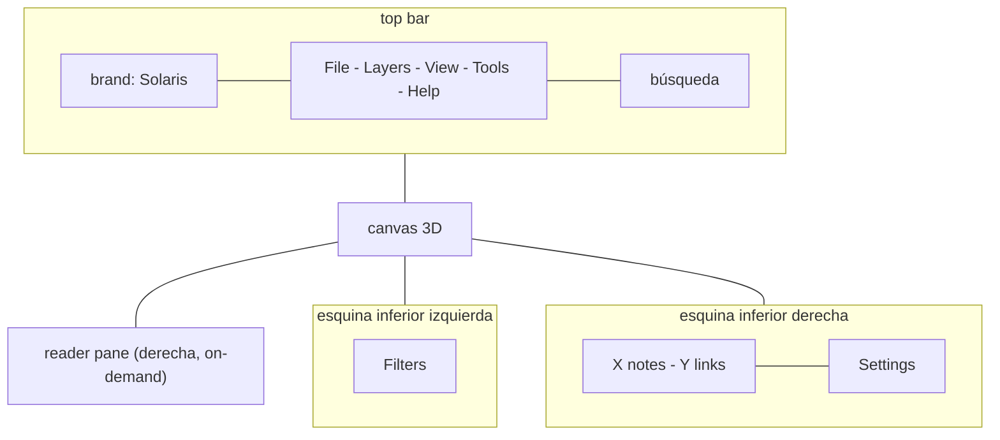
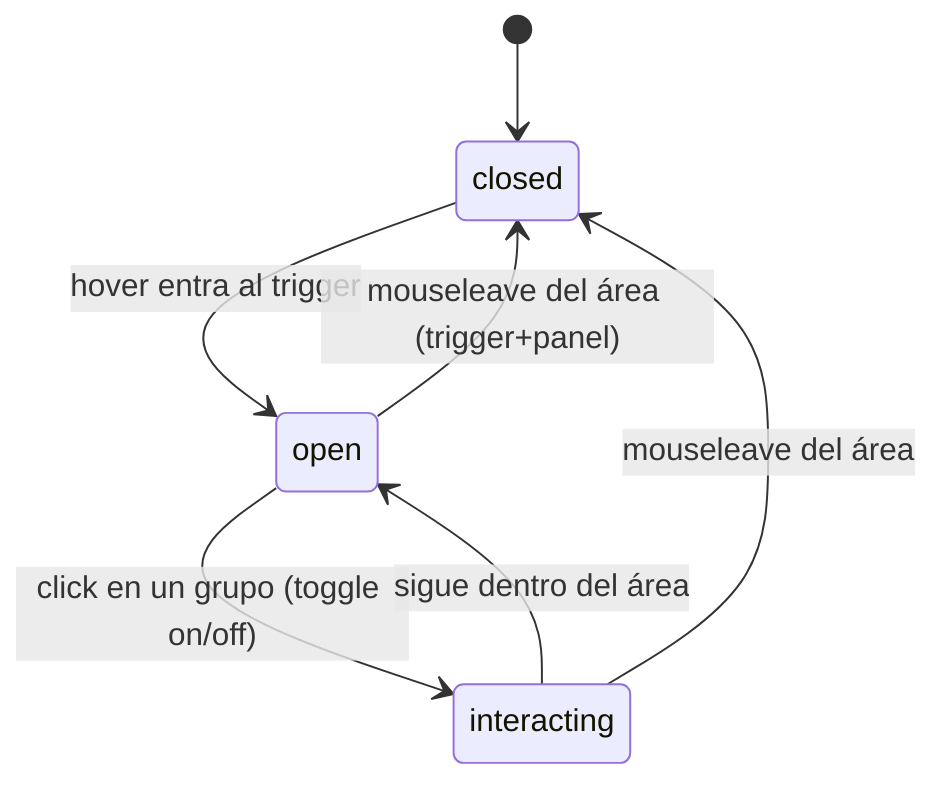

**Target repo:** `~/Documents/GitHub/akasha` (fork de `chntnm/akasha`, renombrado a Solaris). Todos los paths son relativos a la raíz de ese repo.

# Solaris Fork - Plan

## Goal Capsule

- Objetivo: convertir el clone de Akasha en el fork "Solaris": rename acotado, un único menú nuevo "Layers" hover-sticky para togglear pillars, consolidación del chrome de UI (controles del bottom bar a los menús View/Tools existentes; Filtros abajo-izquierda; Settings + conteos abajo-derecha; solo búsqueda arriba), apretar el scan para excluir pillars de ruido, y sumar una capa de tests Vitest sobre la lógica del scanner y el guard de path-traversal del server.
- Autoridad: este plan > (sin `STRATEGY.md` en el repo) > convenciones del repo y preferencias del usuario.
- Stop conditions: los 6 unidades terminadas; `npm test` y `npm run typecheck` en verde; checklist visual manual pasado corriendo contra FeloVault; dev server sin errores de consola.
- Execution profile: `code`; incremental por U-ID; test-first para scanner y guard de path-traversal.
- Tail ownership: el agente que ejecuta (`ce-work` / `/goal`) confirma el DoD; Felo aprueba el rename final y la posición exacta de los menús.

---

## Product Contract

### Summary

El fork Solaris reestructura el chrome de UI de Akasha para liberar el canvas: un único menú nuevo "Layers" hover-sticky para togglear pillars; los controles del bottom bar se consolidan en los menús View/Tools existentes; Filtros queda abajo-izquierda y Settings + conteos notes/links abajo-derecha, dejando solo la búsqueda arriba. Aprovecha el fork para renombrar la app, excluir pillars de ruido del scan, y blindar con Vitest la lógica del scanner y el guard de seguridad del server.

### Problem Frame

Akasha resuelve el ~90% de la visualización 3D del vault (auditado: read-only sobre el vault, local-only, MIT), pero el chrome de UI satura el canvas: el panel de pillars siempre visible a la izquierda, un bottom bar con controles duplicados respecto al menú View, y los conteos en la esquina superior derecha. Felo quiere un canvas limpio con la navegación 3D como protagonista, togglear pillars desde un menú que se abre con hover y se mantiene abierto para marcar varios de un solo pase, y consolidar los controles sin perder funcionalidad. El fork es también el momento de renombrar a Solaris y de proteger con tests las dos superficies más valiosas y baratas: el parser de links (que se customizará para la convención dual del vault) y el guard de path-traversal del server (seguridad).

### Requirements

*Identidad y fork*

- R1. La app se llama "Solaris" en los strings visibles (brand, `<title>`, texto de About, prefijo del archivo exportado) y en los metadatos (`package.json`: name, description, productName, appId).
- R2. El fork mantiene el upstream (`chntnm/akasha`) como remote `upstream` y el remote propio de Felo como `origin`, para permitir rebases futuros.

*UI: canvas limpio y menú Layers*

- R3. Un único menú nuevo, "Layers", permite togglear (on/off) los pillars/grupos del grafo, con sus swatches, color-pickers y estado on/off.
- R4. El panel de Layers se abre con hover sobre el trigger; se mantiene abierto mientras el cursor esté dentro del área del panel (trigger + dropdown); los clicks que toggleean un grupo NO cierran el panel; cierra cuando el cursor sale del área, permitiendo togglear varios grupos en una sola apertura.
- R5. Los controles del bottom bar (checkboxes glow/labels/unwritten/orphans, focus depth, group by, graphics, node style, theme) se reubican en los menús existentes View y Tools; los selects theme/graphics (duplicados hoy en el bottom y en View) se eliminan del bottom; el bottom bar desaparece como contenedor.
- R6. Filtros queda como botón en la esquina inferior izquierda; Settings y el conteo de notes/links quedan en la esquina inferior derecha (conteos a la izquierda de Settings). La barra superior conserva únicamente brand, menús y búsqueda; los conteos se eliminan de la barra superior.
- R7. El color azul de los links (`a.wiki`) en el reader se mantiene sin cambios: es el azul deseado, no se "corrige" el contraste.

*Scan*

- R8. El scan excluye por defecto los pillars de ruido de FeloVault: `.firecrawl`, `.gsd`, `.n8n`, `.opencode`, `history`, además de los excludes actuales.

*Tests*

- R9. Una capa de tests Vitest cubre la lógica pura del scanner (resolución de wikilinks y md-links, frontmatter, phantom nodes, excludes) y el guard de path-traversal del endpoint `/api/note` (rechaza rutas fuera del vault, rutas no-`.md`, ids `phantom:`; acepta rutas válidas).

### Scope Boundaries

*Deferred for later*

- Features de "mundos" más allá del coloreo de pillars existente: clustering semántico, auto-linking por IA, navegación tipo salto entre clusters, vista temporal.
- Optimización de rendimiento para más de ~10k nodos (el vault actual de conocimiento es ~4k).
- Soporte mobile/touch.
- Remediación de las vulnerabiliedades de `npm audit` (son transitivas de build/electron-builder, no del runtime que toca el vault; no bloqueantes).
- Framework de tests para el frontend UI: se verifica manual/visual; un smoke de Playwright es opcional y no se incluye en este plan.
- Renombrar los `localStorage` keys `akasha-*` (`akasha-theme`, `akasha-filters`, `akasha-pc`): se mantienen por continuidad de las preferencias guardadas.

*Outside this product's identity*

- Publicación/distribución (builds Electron para distribución, sitio, marketing).
- Cambiar el protocolo `obsidian://` o la política de lectura del vault (read-only, se conserva intacta).

---

## Planning Contract

### Key Technical Decisions

- KTD1. Framework de tests: Vitest (Vite-native, zero-config para TS/ESM). Para el server se usa `supertest` contra la app Express. Descartado Jest (más pesado, más config para ESM).
- KTD2. Los tests se enfocan donde el costo/beneficio es alto: scanner (lógica pura, alto valor, barato) y guard de path-traversal del server (seguridad-crítico, barato). El frontend UI (vanilla TS + Three.js + DOM) se verifica manual/visual: unit-testear interacciones DOM y el grafo 3D es frágil y de bajo ROI para un fork personal.
- KTD3. Menú Layers = hover-sticky. La región trigger+dropdown es un único contenedor con `mouseenter`/`mouseleave` (hover bridge, sin gap entre trigger y panel); los clicks internos no cierran; el cierre ocurre por `mouseleave` del contenedor. Reutiliza el modelo existente (`pillarOn`, `colorOf`, `groupOf`). Descartados: hover puro sin bridge (frágil en la diagonal) y click-to-pin (Felo eligió explícitamente hover).
- KTD4. Rename acotado: strings visibles + `package.json` (name, productName, appId, description) + `<title>` + prefijo del filename exportado. No se renombran: URLs de repo (se completan en U1 cuando exista el remote propio), `localStorage` keys (continuidad), nombre del binario `npx` (irrelevante salvo publicación).
- KTD5. Distribución de controles: los visuales/display (theme, graphics, node style, group by, focus depth, toggles glow/labels/unwritten/orphans) van al menú View; las utilidades de acción quedan en Tools (Display Settings, Copy Link, Open in Obsidian). File y Help quedan como están. Layers es el único menú nuevo, posicionado junto a View.
- KTD6. El `#hint` (pista de keybinds) del bottom bar se mueve al menú Help (ya existe "Keyboard & Mouse Controls") o se elimina; no se reubica flotando sobre el canvas.

### High-Level Technical Design

Chrome objetivo (regiones), el canvas es protagonista:

Comportamiento hover-sticky del menú Layers (machine de estados):

### Sequencing

U1 (fork + rename) primero para sentar identidad y remote. U6 (excludes) se hace con U2 (sus tests los cubren). U2 y U3 (tests) son independientes del UI. U4 (Layers) y U5 (consolidación) son los cambios de UI y conviene hacerlos juntos en un solo pase visual del chrome.

---

## Implementation Units

### U1. Fork setup + rename a Solaris

- Goal: establecer el fork (remotes) y renombrar la app a Solaris (rename acotado).
- Requirements: R1, R2.
- Dependencies: ninguno (va primero).
- Files: `package.json`, `web/index.html`, `web/src/main.ts`, `desktop/main.ts`, `README.md` (opcional).
- Approach: `git remote rename origin upstream`; crear el repo propio y `git remote add origin <url>`; `git push -u origin main`. Renombrar strings: `#brand-name`, `<title>`, texto de About (`#mi-about`), prefijo `akasha-` del export PNG, títulos de ventana en `desktop/main.ts`, y `package.json` (name, description, productName, appId). Dejar intactos los `localStorage` keys y las URLs de repo hasta tener el remote propio.
- Test expectation: none - el rename es de strings y metadatos; se verifica manualmente.
- Verification: `npm run typecheck` pasa; al abrir la app el brand dice Solaris; exportar PNG produce un archivo con prefijo `solaris-`; `git remote -v` muestra `upstream` y `origin`.

### U2. Vitest scaffold + tests del scanner

- Goal: agregar Vitest y cubrir la lógica pura del scanner.
- Requirements: R9.
- Dependencies: ninguno.
- Files: `package.json` (devDeps `vitest`, script `test`), `vitest.config.ts` (nuevo), `scanner/scan.ts`, `scanner/scan.test.ts` (nuevo), `scanner/fixtures/` (nuevo, archivos `.md` de prueba).
- Approach: instalar `vitest`; config mínima (entorno node, glob `**/*.test.ts`); el scanner ya exporta `scanVault`. Invocarlo contra fixtures con wikilinks, md-links, frontmatter, tags y targets inexistentes. Casos: `[[A]]` por basename, `[[folder/file]]` por path, `[text](path.md)` relativo (con `..`), frontmatter OKF (title/type/tags), tags inline como fallback, phantom nodes para targets no resueltos, excludes (incluyendo los nuevos de U6), cache versioning, self-links ignorados.
- Execution note: test-first - escribir los casos de resolución de links antes de cualquier cambio en el parser.
- Test scenarios: `[[A]]` resuelve a `a.md`; `[x](b.md)` relativo resuelve al `b.md` del mismo dir; `[x](../sub/c.md)` normaliza `..`; el `title` del frontmatter se usa como label; `[[NoExiste]]` genera phantom node; `--exclude .gsd` omite ese dir; un archivo bajo un DEFAULT_EXCLUDES se omite; cambiar `CACHE_VERSION` invalida el cache.
- Verification: `npm test` pasa; los casos cubren las dos sintaxis de link y los excludes.

### U3. Tests del guard de path-traversal del server

- Goal: blindar con tests el confinamiento de `/api/note`.
- Requirements: R9.
- Dependencies: U2 (Vitest instalado).
- Files: `server/app.ts`, `server/app.test.ts` (nuevo), `package.json` (devDep `supertest`).
- Approach: usar `supertest` contra la app Express creada por `createApp` con un `graph.json` fixture cuyo `vaultPath` apunte a un dir temporal con notas `.md`. Casos: id `../../etc/passwd` rechazado; `phantom:x` rechazado; id sin `.md` rechazado; id válido dentro del vault aceptado con su markdown.
- Execution note: test-first - escribir el caso de traversal antes de confirmar el guard existente.
- Test scenarios: traversal rechazado (400); non-`.md` rechazado (400); `phantom:` rechazado (404); id válido retorna markdown (200).
- Verification: `npm test` pasa; el guard rechaza todos los casos maliciosos.

### U4. Menú Layers hover-sticky

- Goal: reemplazar el `aside#legend` siempre visible por un menú Layers hover-sticky en `#menubar`.
- Requirements: R3, R4.
- Dependencies: ninguno (orden libre, pero conviene junto con U5).
- Files: `web/index.html`, `web/src/main.ts`, `web/src/style.css`.
- Approach: añadir un `.menu` "Layers" a `#menubar` (junto a View). Su dropdown contiene el contenido actual del legend (swatches, color-pickers, estado on/off por grupo). El contenedor trigger+dropdown maneja `mouseenter`/`mouseleave`: hover abre, los clicks en items toggleean `pillarOn[g]` y repintan sin cerrar, `mouseleave` del área cierra. Reutilizar `pillarOn`, `colorOf`, `groupOf` y el filtro que ya aplica el grafo. Quitar el `aside#legend` siempre visible. Asegurar hover bridge (sin gap) entre trigger y panel para evitar cierre en la diagonal.
- Technical design: ver state diagram en High-Level Technical Design.
- Test scenarios (manual/visual): hover sobre "Layers" abre el panel; mover el cursor al panel lo mantiene abierto; click en un grupo lo togglea y el panel sigue abierto; togglear 3 grupos seguidos sin re-abrir; sacar el cursor del área cierra el panel; el grafo refleja los grupos apagados.
- Verification: checklist visual manual; el panel no se cierra al click; cierra al `mouseleave`.

### U5. Consolidar controles en View/Tools + reubicar Filters/Settings/conteos

- Goal: eliminar el bottom bar; mover controles a View/Tools; Filters abajo-izquierda; Settings + conteos abajo-derecha; solo búsqueda arriba.
- Requirements: R5, R6 (R7 se preserva sin acción).
- Dependencies: U4 idealmente hecho (un solo pase del chrome), no bloqueante.
- Files: `web/index.html`, `web/src/main.ts`, `web/src/style.css`.
- Approach: los selects theme/gfx ya existen en View (`#mi-themes`, `#mi-gfx`); eliminar los duplicados del bottom y conectar los del menú. Añadir al dropdown de View: checkboxes glow/labels/unwritten/orphans, focus depth, group by, node style. Reposicionar `#filters-btn` (fixed bottom-left) y `#settings-btn` + `#brand-stats` (fixed bottom-right, conteos a la izquierda de Settings). Mover `#hint` al Help menu o eliminarlo. Reconectar los listeners a los nuevos IDs. Eliminar `div#controls` y sus estilos de bottom bar.
- Test scenarios (manual/visual): la top bar solo tiene brand + menús + búsqueda; theme cambia desde View y ya no está en el bottom; togglear "glow" desde View afecta el grafo; Filters abre desde bottom-left; Settings abre desde bottom-right; los conteos se ven bottom-right; no queda nada del bottom bar; el keybind hint no flota sobre el canvas.
- Verification: checklist visual manual; `npm run typecheck` pasa (TS detecta IDs/refs rotas).

### U6. Apretar excludes del scan

- Goal: excluir por defecto los pillars de ruido de FeloVault.
- Requirements: R8.
- Dependencies: U2 (los tests cubren excludes).
- Files: `scanner/scan.ts`.
- Approach: añadir `.firecrawl`, `.gsd`, `.n8n`, `.opencode`, `history` al array `DEFAULT_EXCLUDES`.
- Test scenarios: cubierto por U2 (un exclude nuevo se testea en `scanner/scan.test.ts`).
- Verification: `npm test` pasa; un re-scan de FeloVault reporta menos pillars (sin los de ruido).

---

## Verification Contract

| Gate | Comando / acción | Aplica a |
|---|---|---|
| Tests unitarios | `npm test` (Vitest) | U2, U3, U6 |
| Typecheck | `npm run typecheck` (`tsc --noEmit`) | U1, U2, U3, U4, U5, U6 |
| UI visual | `npm run dev`, abrir `http://localhost:5173`, checklist manual | U4, U5 |
| Scan | `npm run scan -- "<vault>"`, confirmar pillars | U6, smoke general |

No hay gate de release/CI (fork personal). El checklist visual manual cubre: Layers hover-sticky (apertura, persistencia al click, cierre al salir), menús consolidados sin duplicados, Filters en bottom-left, Settings + conteos en bottom-right, top bar solo brand+menús+búsqueda, brand "Solaris".

---

## Open Questions

### From 2026-07-01 ce-doc-review (headless)

Accionables (address during implementation):

- D1 (P1): El color-picker nativo `<input type=color>` dentro del panel Layers entrega foco a un overlay del OS fuera del área trigger+panel, el browser lo lee como `mouseleave` y cierra el panel mientras se elige color. Resolver en U4: mantener el panel abierto mientras un control de color tiene foco o su picker está abierto (track vía `focusin`/`focusout`, o añadir un estado "picker-open" al diagrama que solo cierra con Esc/click-away).
- D2 (P1, decisión): El menú Layers es mouse-only (hover). La keyboard a11y de desktop no está cubierta. Decisión de Felo: ¿es requerido operar Layers por teclado? Si sí, añadir a U4: trigger como botón real (`aria-haspopup`, `aria-expanded`), abrir con foco/Enter, flechas entre grupos, Space/Enter togglea, Esc cierra devolviendo foco al trigger; y gatear `mouseleave` para que no dispare mientras el foco está dentro.
- C2 (P3): U3 agrupa `phantom:` con los rechazos 400 en el Approach, pero los Test scenarios (y `server/app.ts`) usan 404. Clarar en U3 Approach que `phantom:` retorna 404 (not-found), no 400.

FYI (opcional):

- D3: Empty-state cuando todos los layers están apagados (canvas en blanco sin mensaje). Opcional: hint "All layers off" + reset.
- D4: Esc/focus-return para el panel Layers (el reader y search usan Esc; Layers no).

Cobertura incompleta del review: feasibility-reviewer y security-lens-reviewer no devolvieron findings (2 intentos). Riesgos no cubiertos a considerar:

- (seguridad, U3) Completar los casos de test del path-traversal: traversal URL-encoded (`..%2f..%2f`), null-byte (`%00`), paths absolutos (`/etc/passwd`), y symlink-escape (un symlink dentro del vault apuntando fuera a un `.md`; `resolve()` no sigue symlinks, así que `startsWith(vaultRoot+sep)` pasa pero `readFileSync` sigue el link). El audit ya nota el caveat.
- (viabilidad, U5) Al mover los inputs de `#controls` a los menús View/Tools, preservar los IDs existentes o reconectar los listeners de `getElementById` en `web/src/main.ts`; theme/gfx ya tienen entradas duplicadas en View (`#mi-themes`, `#mi-gfx`) — cuidar no romper el wiring.

---

## Definition of Done

Global:

- Las 6 unidades (U1 a U6) completadas.
- `npm test` y `npm run typecheck` en verde.
- Dev server corre contra FeloVault (`http://localhost:5173`) sin errores de consola.
- Checklist visual manual pasado (Layers hover-sticky, menús consolidados, esquinas, brand Solaris).
- No queda código de intentos abandonados en el diff.

Per-unidad: los criterios de Verification de cada U.
