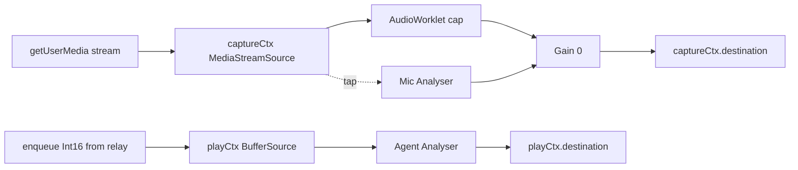

# Voice Waveform Spectrum and Context-Aware Footer - Plan

## Goal Capsule

- **Objective:** Add a subtle, signal-driven waveform above the footer that renders only during voice sessions, and make the footer context-aware so it mirrors whichever panel is open and shows voice session info while talking.
- **Product authority:** Felo's personal Solaris tool. Feature-tier: extends the existing voice integration and the existing reader/research panels, no new product surface.
- **Open blockers:** None. Implementation-ready.
- **Execution profile:** Code, manual UI verification (no frontend test framework).
- **Tail ownership:** implementer owns the build; `harness-verify` before commit per AGENTS.md.

## Product Contract

*Product Contract unchanged from brainstorm. Two implementation units (U1 spectrum, U2 footer) added below; both edit the bottom-center zone so they serialize U1 then U2.*

### Summary

A subtle horizontal waveform mounts above the footer only while a voice session is live, rendered from real mic and agent-output audio, one color at a time: the active speaker in the theme's `--accent`, the other in its complement. The footer below it stops being a static notes/links counter and becomes context-aware: each side mirrors its panel, reverts to notes/links when that panel closes, and during voice shows the provider/voice name and a session timer.

### Problem Frame

The bottom-center footer shows a static `X notes · Y links` count regardless of what is open or whether voice is active. During voice sessions there is no visual signal that the mic is hearing you, that the agent is responding, or whose turn it is. And the one always-visible status slot is spent on numbers that only matter when nothing is selected. Voice already works (full Gemini Live relay in `web/src/voice.ts`), but it has no on-screen presence outside the search-bar toggle.

### Key Decisions

- **Real signal, not fake animation.** Exa confirmed a browser waveform is cheap (Canvas at roughly 0.1ms/frame; `AudioWorklet` already in `voice.ts` keeps mic analysis off the main thread). The fake-animation fallback is dropped.
- **One color at a time.** Gemini's interruption model means human and agent audio never overlap, so simultaneous-source encoding is unused complexity. The line takes the color of whoever is currently speaking.
- **Complement derived at runtime, not a new theme slot.** The "other" color is the HSL complement of the active theme's `--accent`, computed in JS. No edits to `THEMES` and it adapts to all 10 themes automatically.
- **Agent gets accent, human gets complement.** Accent reads as "the system"; the human gets the derived color.
- **Voice overrides the footer entirely while active.** Both sides show voice info during a session, regardless of reader/research state, then revert.
- **Two independently implementable pieces.** The spectrum and the footer share the bottom-center zone but no code paths; each can be built and merged on its own.

### Requirements

**Spectrum**

- R1. While a voice session is live, a horizontal waveform renders on a canvas directly above `#brand-stats`, centered, with bounded width and `pointer-events: none`, so it never blocks the graph or the footer.
- R2. The waveform reflects real-time audio from the mic input (human) and from the agent's playback audio (agent), tapped from the existing voice graph in `web/src/voice.ts`.
- R3. Only one color renders at a time. Human speaking uses the complement of the active theme's `--accent`; agent speaking uses `--accent`; idle (neither) renders a flat, dim, low-opacity line.
- R4. The waveform mounts when a voice session starts and unmounts when it ends. Zero render cost and no DOM presence when voice is off.
- R5. The render cost is negligible relative to the 3D graph: it runs only during voice, on a single `requestAnimationFrame` loop with no per-frame allocations.

**Footer**

- R6. The footer's left half mirrors the content/reader panel: shows a content-size metric (word count) when a real note is open in the reader, and reverts to the notes count when the reader closes.
- R7. The footer's right half mirrors the research panel: match count for semantic results, result count for web, percent during ingest, word count for article/document views; it reverts to the links count when research closes.
- R8. While a voice session is live, both halves are overridden: left shows provider and voice name, right shows a session timer. On voice end, the footer reverts to whatever reader/research state dictates.
- R9. Each half reverts to its default the moment its panel closes, independent of the other half.

### Key Flows

- F1. Spectrum lifecycle.
  - **Trigger:** voice toggle on / voice session ends.
  - **Actors:** `web/src/voice.ts`, `web/src/main.ts`.
  - **Steps:** session starts, mount the canvas and start the frame loop reading both audio sources; session ends, cancel the loop and unmount the canvas.
  - **Outcome:** the waveform is visible and reading real audio only during voice.
- F2. Footer state resolution.
  - **Trigger:** any change to reader open/close, research mode or open/close, or voice toggle.
  - **Actors:** `web/src/main.ts`.
  - **Steps:** resolve each half by precedence (voice overrides everything; otherwise the half mirrors its panel, else default), write both halves.
  - **Outcome:** the footer always reflects the highest-precedence active context, per half.

### Acceptance Examples

- AE1. Turn-taking color.
  - **Given** a live voice session.
  - **When** the user speaks, the line is the complement color; when the agent responds, the line is the accent color; when both are quiet, the line is flat and dim.
  - **Covers R3, R5.**
- AE2. Voice overrides an open research panel.
  - **Given** research results are open and the right half reads `12 matches`.
  - **When** a voice session starts, the right half switches to the session timer and the left to the provider/voice name.
  - **When** voice ends, the right half returns to `12 matches`.
  - **Covers R7, R8, R9.**
- AE3. Footer reverts on close.
  - **Given** the reader is open and the left half reads `842 words`.
  - **When** the reader closes, the left half reverts to the notes count.
  - **Covers R6, R9.**
- AE4. Zero cost when voice is off.
  - **Given** no voice session is live.
  - **Then** the waveform canvas is absent from the DOM and no frame loop runs.
  - **Covers R4.**

### Scope Boundaries

- **Deferred for later:** a turn-count metric (needs turn detection from the analyser); radial, equalizer, or simultaneous-dual-source visualizers.
- **Outside this feature:** server-side voice relay changes (the analyser is browser-only); new theme slots (the complement is runtime-derived); any vault writes (the footer is display-only and the spectrum is read-only on the audio graph).

### Sources / Research

- Exa brief on dual-source browser waveform: `/tmp/compound-engineering/ce-brainstorm/audio-spectrum-footer-2026-07-05/exa-research.md`. Load-bearing takeaways for the implementer: two `AnalyserNode`s (one per source), tap the existing `AudioWorklet` mic chain and the `createBufferSource` playback chain, render on Canvas (not DOM bars), `fftSize` around 512 with `smoothingTimeConstant` around 0.85 for a calm voice trace, allocation-free frame loop. ElevenLabs LiveWaveform is the canonical "subtle" reference shape.
- Verified grounding dossier: `/tmp/compound-engineering/ce-brainstorm/audio-spectrum-footer-2026-07-05/grounding.md`. Code pointers: `web/src/voice.ts:103` and `:169` (the two `AudioContext`s), `:176-188` (mic chain to tap for the human analyser), `:106-120` (playback chain to tap for the agent analyser); `web/index.html:212` and `web/src/style.css:414-421` (`#brand-stats`); `web/src/main.ts:2481` and `:4741` (the two footer write sites to replace with a unified state-driven updater); `:595` (`selected`), `:3305` (`voiceSession`), `:3746` (`researchMode`), `:3339` (`setVoiceActive`) as the state signals driving R6-R9.

## Planning Contract

### Key Technical Decisions

- KTD1. **Two persistent Analysers, not per-frame.** One `micAnalyser` on `captureCtx`, one `agentAnalyser` on `playCtx`. The agent analyser is a single persistent node every playback `BufferSource` connects through (source -> analyser -> destination), so all agent audio is measured by one node and no per-source bookkeeping is needed.
- KTD2. **Mic tap is parallel to the worklet.** `srcNode` connects to BOTH the worklet (for PCM upload, unchanged) and `micAnalyser`; the analyser routes to the existing muted `Gain` so the graph stays alive without reaching the speakers.
- KTD3. **Canvas, rAF, allocation-free.** `fftSize` 512, `smoothingTimeConstant` 0.85 (Exa-confirmed calm-voice values). The frame loop reads both analysers' byte-frequency data into pre-allocated typed arrays.
- KTD4. **Speaking detection by RMS threshold with hysteresis.** Color follows whoever is above threshold; both below renders the idle line. Exact threshold deferred to implementation - tune against real mic and agent levels.
- KTD5. **Complement color at runtime.** Read the active theme's `--accent`, convert to HSL, rotate hue 180 degrees, preserve S/L. No `THEMES` edits, adapts to all 10 themes.
- KTD6. **Footer is two spans driven by one updater.** `#brand-stats` becomes a container with two child spans; a single `updateBrandStats()` resolves each half by precedence and replaces the two write sites at `main.ts:2481` and `:4741`. It is called from selection, research, panel dock/close, voice toggle, and rescan hooks.

### High-Level Technical Design

Audio tap topology:

Footer precedence, resolved per half on every state change:

| Half | Voice live? | Panel state | Shows |
|---|---|---|---|
| Left | yes | any | `provider · voice name` |
| Left | no | reader open, real note | `N words` |
| Left | no | reader closed | `N notes` |
| Right | yes | any | `mm:ss` session timer |
| Right | no | research: semantic | `N matches` |
| Right | no | research: web | `N results` |
| Right | no | research: ingest | `N%` |
| Right | no | research: article/document | `N words` |
| Right | no | research closed | `N links` |

### Sequencing

U1 (spectrum) before U2 (footer). Both edit the bottom-center DOM (`#brand-stats` area in `web/index.html`) and adjacent `web/src/style.css`, so they serialize to avoid merge conflicts. After this plan, Plan 005 (topbar) follows; it touches different regions and does not conflict.

## Implementation Units

### U1. Voice waveform spectrum

- **Goal:** Render a signal-driven waveform above the footer, live during voice sessions only.
- **Requirements:** R1, R2, R3, R4, R5.
- **Dependencies:** none.
- **Files:** `web/src/voice.ts` (analyser taps, expose to UI), `web/index.html` (canvas element above `#brand-stats`), `web/src/main.ts` (mount/unmount with `voiceSession`, rAF render loop, speaking detection, color derivation), `web/src/style.css` (canvas positioning). No test file - frontend has no test framework (verified in AGENTS.md).
- **Approach:** Add `micAnalyser` on `captureCtx` and `agentAnalyser` on `playCtx` per KTD1/KTD2. Expose them to `main.ts` (return from `startVoice` or via a handler). Add `<canvas id="voice-spectrum">` above `#brand-stats`. On `voiceSession` start, mount the canvas and start the rAF loop reading both analysers; on end, cancel and unmount. Each frame: compute RMS for mic and agent, pick the color by who is speaking (KTD4), derive the complement (KTD5), draw a horizontal waveform.
- **Patterns to follow:** the existing `AudioContext`/worklet wiring in `web/src/voice.ts`; existing rAF usage in `web/src/main.ts` (3D graph render loop).
- **Test scenarios:** (manual - no frontend framework)
  - Covers AE1: start voice, speak (line is complement), agent responds (line is accent), silence (flat dim).
  - Covers AE4: stop voice, confirm canvas is removed from the DOM and no rAF runs (DevTools).
  - Threshold tuning: hysteresis prevents flicker on breath and background noise.
  - Performance: 3D graph FPS unchanged with the spectrum running (DevTools Performance).
  - Theme: switch themes; both colors adapt (accent plus its runtime complement).
- **Verification:** waveform matches the active speaker during voice; clean unmount on end; no FPS regression; `npm run typecheck` clean.

### U2. Context-aware footer

- **Goal:** Footer mirrors its panels and shows voice info during voice.
- **Requirements:** R6, R7, R8, R9.
- **Dependencies:** U1 (same DOM region; sequence after).
- **Files:** `web/index.html` (split `#brand-stats` into two spans), `web/src/main.ts` (`updateBrandStats()`, replace write sites at `:2481` and `:4741`, hook into selection/research/voice state), `web/src/style.css` (two-span layout).
- **Approach:** Replace the single `#brand-stats` text node with a container holding two spans (`#brand-stats-left`, `#brand-stats-right`). Write `updateBrandStats()` resolving each half by the precedence table above. Call it from `select`/`clearSelection`, `openResearch`/`closeResearch`, `setVoiceActive`, and the rescan path (replacing both existing write sites). Word count comes from the open note's content; research counts from `researchHistory` length and `researchMode`; voice info from `voiceSession` plus the provider/voice config.
- **Patterns to follow:** existing state-driven UI updates in `web/src/main.ts`; the two existing `#brand-stats` write sites are the pattern being replaced.
- **Test scenarios:**
  - Covers AE2: with research open showing `12 matches`, start voice (footer shows provider+voice left, timer right); end voice (reverts to `12 matches`).
  - Covers AE3: open a note (left shows word count); close reader (left reverts to notes count).
  - Rescan: after `/api/rescan`, footer updates notes/links when nothing else is open.
  - Per-side independence: open reader (left=words) without research (right=links default); close reader, left reverts, right unchanged.
  - Voice provider: switching provider/voice config reflects in the left half during voice.
- **Verification:** footer reflects the right state at every transition; `npm run typecheck` clean.

## Verification Contract

- `npm run typecheck` (`tsc --noEmit`) - both units must pass.
- `npm test` - existing scanner and server tests stay green. These units add no server code; this guards against accidental regressions in shared modules.
- Manual: `npm run dev`, exercise each AE in the browser. The frontend has no test framework per AGENTS.md, so UI changes are verified manually.
- Release-blocking trust-model negatives (path traversal, consent gates, token enforcement) are untouched by these units; keep `server/app.test.ts` and `server/integrations/*.test.ts` green.

## Definition of Done

- **Global:** `npm run typecheck` clean; `npm test` green; no new server routes or vault writes; the spectrum unmounts when voice is off (zero cost); the footer never shows stale state.
- **U1:** waveform renders from real mic and agent signal during voice; one color at a time per speaker; flat dim idle; unmounts on end; no FPS regression.
- **U2:** both footer halves resolve by precedence; voice overrides both; each half reverts when its panel closes; both old write sites replaced.
- **Cleanup:** no experimental or dead code left in the diff.
