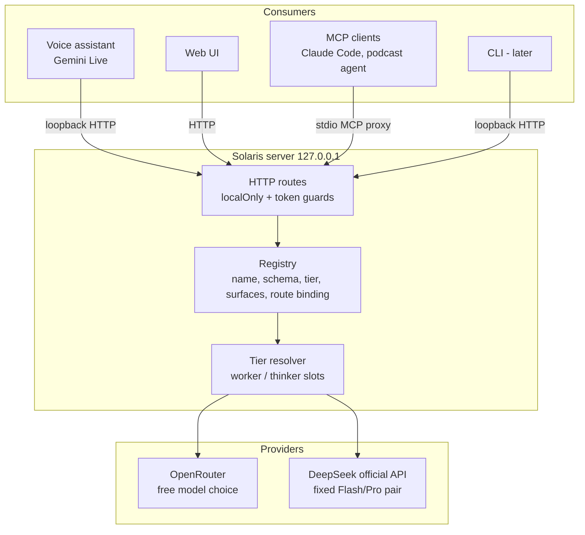
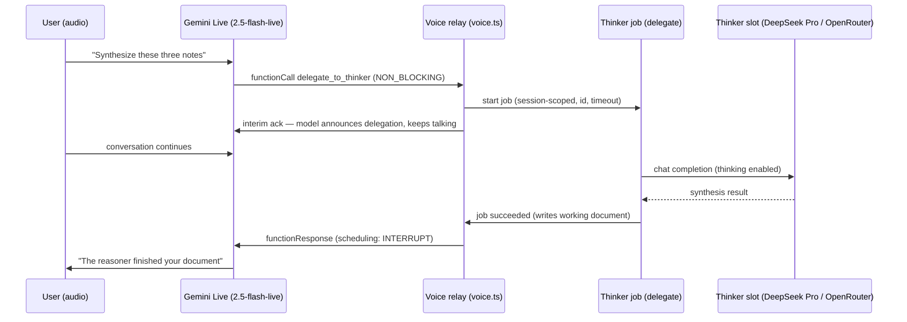

# Two-Tier LLM Orchestration - Plan

## Goal Capsule

- **Objective:** Put one operation/tool registry underneath everything Solaris does with LLMs, tier every operation as worker (fast/cheap) or thinker (reasoning), support OpenRouter and the official DeepSeek API, let the voice assistant delegate heavy synthesis to the thinker without breaking conversation, and expose the registry to external clients via a stdio MCP server (CLI after).
- **Authority hierarchy:** This plan > repo conventions in `AGENTS.md` (write path, security model, degradation patterns) > implementer judgment. Where the plan and observed code behavior disagree, preserve observed behavior and flag the discrepancy.
- **Stop conditions:** Stop and surface (do not guess) if a unit requires weakening a trust-model test (path traversal, consent gate, token enforcement), adding a second vault write path, or exposing the server beyond loopback.
- **Execution profile:** One unit per commit, phases in order (A tiers → B registry → C delegation → D external surfaces). Within a phase, follow unit order. `npm test` + `npm run typecheck` green after every unit.
- **Tail ownership:** Implementer runs the Verification Contract after every unit and the full Definition of Done at the end.
- **Open blockers:** None. Voice-parity on `gemini-2.5-flash-live` is a verification gate inside U7, not a pre-plan blocker.

---

## Product Contract

**Product Contract preservation:** changed R4, R7, R9, R11, R13, R15, R17 and one Scope Boundary from the requirements-only version — R4 per verified DeepSeek docs (no `auto`/`medium` effort exists), R7/R9/R13/R15 and the voice-model boundary per the user-confirmed plan synthesis (per-tool surface scoping, normalized search results, native async delegation on `gemini-2.5-flash-live`, stdio MCP with the ChatGPT app deferred, in-place-edit opt-in). All other text and IDs preserved.

### Summary

A tool/operation registry becomes the single source of truth for every LLM-backed operation and voice tool in Solaris. Each registered operation carries a tier — worker or thinker — resolved through two config slots that can point at OpenRouter (free model choice) or the official DeepSeek API (fixed Flash/Pro pair). The voice assistant, the HTTP routes, and a new stdio MCP server (plus a later CLI) all consume the same registry; voice additionally gains an async delegate-to-thinker tool whose result lands in the session's working document.

### Problem Frame

All four server-side LLM operations run on one config field (`defaultModel`, falling back to `deepseek/deepseek-v4-flash`). Synthesis-heavy work — wiki-ingest proposals push ~60k chars of contracts plus source through that flash model — comes out shallow, which is the concrete trigger for this work. At the same time, fast operations (note questions, commit messages, query rewrites) are well served by a flash-class model and should stay on one for latency and cost.

The voice assistant has a parallel ceiling: its own realtime model handles conversation fine but cannot do cross-document reasoning, and it has no way to hand that work to a stronger model without stalling the conversation.

Externally, consumers already exist but connect ad hoc: the `podcast-sociedad-paralela` agent calls `GET /api/semantic-search` over raw loopback HTTP, and Claude Code has no supported surface at all. The 19 voice tools already dispatch through loopback HTTP against the server's own routes — a de-facto registry that is declared only inside the voice layer and cannot be reused.

### Key Decisions

- **Registry first, but tiers land as step 1 inside it.** The unified registry is the structural spine (voice, routes, MCP, CLI all consume it), yet the two config slots and the per-operation tier map ship as the first increment (Phase A) so the synthesis-quality fix does not wait on the tool refactor.
- **Provider asymmetry is deliberate.** DeepSeek official API auto-assigns its fixed pair (`deepseek-v4-flash` to worker, `deepseek-v4-pro` to thinker) with no model picker; OpenRouter allows free model choice per slot. Providers may be mixed across slots.
- **Static per-operation tier map, no dynamic routing.** Each operation declares its tier at registration. The map itself (the full inventory of LLM operations and voice tools) is a deliverable.
- **Delegation result is a working document plus a spoken heads-up.** The thinker writes into the voice session's existing working-document flow; the assistant announces the handoff aloud, keeps conversing, and gives a spoken heads-up when the result is ready. Promotion to the vault stays user-triggered.
- **MCP exposes the write surface, with one narrowing.** External local clients get the voice assistant's trust level — local, path-confined, journaled, single sanctioned write path — except in-place note editing (`edit_vault_note`), the only operation that can replace existing content, which sits behind a config opt-in.
- **Every registry operation declares its surfaces.** `voice | http | mcp | cli` scoping keeps browser-bound tools (current view, open note/resource) and the voice-only delegate tool off surfaces where they are meaningless or circular.
- **MCP before CLI.** Claude Code and the podcast agent speak stdio MCP or HTTP today; the CLI is a thin last wrapper. The ChatGPT app is deferred if it requires a network-reachable endpoint (conflicts with loopback-only).
- **The voice assistant's realtime providers are untouched; the Gemini live model becomes selectable.** Delegation uses Gemini's native async function calling, which requires `gemini-2.5-flash-live`; sessions on models without async support degrade gracefully (see KTD5).

### Requirements

**Model tiers and providers**

- R1. Config defines two model slots, `worker` and `thinker`. Every server-side LLM operation resolves its model through its tier; no operation reads a single global model directly.
- R2. Both OpenRouter and the official DeepSeek API are supported, with one stored key per provider. Each slot resolves to a provider plus model, and slots may use different providers.
- R3. With DeepSeek as a slot's provider, the model is fixed by the system (`deepseek-v4-flash` for worker, `deepseek-v4-pro` for thinker); with OpenRouter, the user picks any model per slot using the existing curated-dropdown-plus-custom-input pattern.
- R4. Thinker-tier DeepSeek calls enable thinking mode with the default reasoning effort (`high`; the API offers only `high`/`max`, no `auto`/`medium`). OpenRouter thinker models pass an equivalent reasoning option only where the model supports one.
- R5. Degradation follows the existing detection-based pattern: no thinker configured means thinker-tier operations run on the worker; no LLM configured at all preserves today's fallbacks (templates, hardcoded commit subject).
- R6. Admin remains the only config surface; keys are stored server-side and never echoed in API responses.

**Operation and tool registry**

- R7. One registry declares every LLM operation and voice tool: name, description, provider-neutral input schema, tier (for LLM-calling operations), surfaces (`voice | http | mcp | cli`), and route binding. Voice tool declarations, MCP tools, and the CLI are derived from it, not duplicated. Voice dispatch stays loopback HTTP (the documented testability boundary); the registry does not collapse it.
- R8. The four existing LLM operations are registered with tiers: worker for note questions, git commit messages, and the contextual research-query rewrite; thinker for wiki-ingest proposal synthesis.
- R9. The five search-shaped voice tools consolidate into three intent-shaped contracts — note discovery, passage answers (with an exact-match option), and expanding a known location — plus folder browse, all returning one normalized result shape (path, title, snippet, optional line). Semantic-to-full-text fallback moves into the handler. No capability is dropped.
- R10. All registry write operations go through the existing sanctioned write path; the registry introduces no second app writer.

**Voice delegation**

- R11. The voice assistant gains a delegate-to-thinker tool for synthesis-type tasks: creating a document from multiple sources, finding relations across notes, deep summarization. The tool is Gemini-live-only: never exposed on OpenAI/xAI realtime sessions (which have no completion-announcement path) and never MCP/CLI-exposed.
- R12. Delegation is asynchronous: the assistant announces the handoff aloud (naming the thinker/reasoner) and continues the conversation while the job runs.
- R13. Delegation uses Gemini Live native async function calling (`NON_BLOCKING` declaration; completion response scheduled to interrupt), verified against `gemini-2.5-flash-live`. The result lands in the session's working document; promotion to the vault stays user-triggered. On live models without async function calling, the tool still starts the job and the result surfaces in the working document, announced on the next turn.
- R14. A failed or timed-out delegation is reported verbally and leaves the session fully functional. One delegation job per voice session at a time.

**External surfaces**

- R15. A stdio MCP server exposes the registry's `mcp`-scoped tools — including create/archive/promote write tools — to local clients, targeting Claude Code and the podcast agent as first consumers. In-place note editing over MCP requires a config opt-in and is off by default.
- R16. A CLI exposes the same operations as a thin wrapper over the registry; it ships after MCP.
- R17. The existing security model holds across all surfaces: server bound to loopback, Host/Origin validation, session token on mutating/spending routes, web-consent and key gates enforced server-side for every surface, and no new network exposure from MCP or CLI. MCP/CLI calls carry a surface-scoped token the server checks against each tool's declared surfaces — surface scoping is enforced server-side, not only inside the bridge.

### Key Flows

- F1. Voice delegation
  - **Trigger:** During a voice session, the user asks for work that needs cross-document reasoning (e.g., "make a document connecting these three notes").
  - **Steps:** Assistant calls the delegate tool (declared `NON_BLOCKING`) with the task and source references; announces aloud that it is handing this to the thinker; conversation continues; the job runs in the background and writes its output into the session's working document; on completion the relay sends the function response scheduled to interrupt, and the assistant tells the user the result is ready, offering to read or summarize it.
  - **Outcome:** User reviews the working document and promotes it to the vault when satisfied, via the existing flow.
  - **Covers:** R11, R12, R13, R14.

- F2. Tier resolution
  - **Trigger:** Any registered LLM operation runs (from a route, a voice tool, MCP, or CLI).
  - **Steps:** The operation's declared tier selects the slot; the slot resolves provider, model, key, endpoint, and (for thinker) thinking options; if the slot is unconfigured, resolution falls back per R5.
  - **Outcome:** The call executes with the resolved model; behavior is identical regardless of which surface invoked it.
  - **Covers:** R1, R2, R3, R4, R5.

### Acceptance Examples

- AE1. **Covers R3.** Given DeepSeek is selected as the thinker slot's provider, when the user opens Admin, then no model picker is shown for that slot and `deepseek-v4-pro` is displayed as fixed.
- AE2. **Covers R5.** Given only a worker is configured, when wiki-ingest proposal synthesis runs, then it completes on the worker model without error or warning noise.
- AE3. **Covers R12, R13.** Given an active voice session on `gemini-2.5-flash-live`, when the user requests a multi-source document, then the assistant says it is delegating to the thinker, keeps answering unrelated questions, and announces the finished document when the completion response arrives.
- AE4. **Covers R10, R15, R17.** Given an MCP client calls a write tool, when the write executes, then it is path-confined, journaled to the changes log, and rejected if it targets anything outside the vault or a non-`.md` path.
- AE5. **Covers R9.** Given the consolidated search tools, when the voice assistant performs any search it could perform before (title discovery, passage answers, literal grep, folder browse), then the same result quality is reachable through the consolidated contracts.
- AE6. **Covers R15.** Given the MCP edit opt-in is off (default), when an MCP client calls the in-place edit tool, then the call is rejected with a message naming the opt-in; creation and archive tools still work.

### Scope Boundaries

- The voice assistant's realtime provider set (Gemini/OpenAI/xAI) is unchanged; within Gemini, the live model becomes selectable so delegation can run on `gemini-2.5-flash-live`.
- No dynamic per-request tier routing or classifier; tier assignment is static per operation.
- Tool consolidation changes contracts, not behavior — no rewrite of what tools can do.
- The CLI is in scope but explicitly last; it must not shape the registry design beyond what MCP already requires.
- No remote/network exposure of any surface; everything stays local-first.
- No per-operation model overrides beyond the two slots (per-operation prompt overrides already exist and stay as they are).

**Deferred to Follow-Up Work**

- ChatGPT app as an MCP consumer, if it requires a network-reachable endpoint (conflicts with loopback-only; revisit when its local-connector story is confirmed).
- Migrating the podcast agent's raw `/api/semantic-search` call to the MCP tool (lives in that repo; this plan only proves the tool exists and documents the connection).
- Durable job storage or a multi-job queue for delegation (session-scoped single job is enough now).

### Dependencies / Assumptions

- The DeepSeek official API is OpenAI-compatible chat completions at `api.deepseek.com` with `thinking` and `reasoning_effort` request fields and a models-list endpoint usable for free key validation. Verified against official docs July 2026; rate-limit and context-ceiling pages were not retrievable — confirm during U2 if capacity matters.
- Legacy DeepSeek model names (`deepseek-chat`, `deepseek-reasoner`) are deprecated July 24, 2026 — use only `deepseek-v4-flash` / `deepseek-v4-pro`.
- Gemini Live async function calling (`behavior: NON_BLOCKING`, `scheduling` on the function response) works on `gemini-2.5-flash-live` and is not supported on `gemini-3.1-flash-live-preview`. Verified against official docs July 2026.
- Assumption (verification gate in U7): `gemini-2.5-flash-live` supports all Gemini voices Solaris currently offers (the curated TTS set in `server/integrations/voice.ts`). Docs indicate the native-audio line carries the full TTS voice set but do not publish a per-model list; verify each offered voice in a live session before defaulting delegation-capable sessions to 2.5. Any voice that fails stays available on the 3.1 model via the model selector.
- The mtime-cached `loadConfig()` and the extracted voice-tools seams (injected `fetchFn`, `createVoiceToolSession`) from the architecture-deepening plan are in place (verified in current code).

---

## Planning Contract

### Key Technical Decisions

- KTD1. **Registry = declaration catalog + route bindings, not a new execution layer.** `server/integrations/registry.ts` declares each operation (name, description, provider-neutral JSON-schema params, tier, surfaces, route binding: method/path/arg mapping). Routes remain the execution surface with their guards; voice generates its Gemini `FunctionDeclaration`s (and the lowercase JSON-schema conversion for OpenAI/xAI realtime) and its dispatch table from the registry while keeping loopback-HTTP dispatch — the documented voice-tools boundary (testability + guard reuse) is preserved, not collapsed.
- KTD2. **MCP transport is stdio, proxying loopback HTTP with a surface-scoped token.** The MCP server runs as a child process spawned by the client and forwards each tool call to the bound route. It obtains its token via `GET /api/session` over loopback (voice reads the token in-process; a separate child cannot), requesting an MCP-scoped token; the server-side guard checks the presented token against the registry's declared surfaces for the target route, so a token held by an MCP client cannot reach routes outside the `mcp` surface (git sync, wiki-ingest apply, web-research spend stay browser/voice-only unless their tools declare `mcp`). The token is fetched lazily and re-fetched once on 403, so a Solaris restart (which rotates tokens) recovers transparently. It inherits `localOnly`, consent/key gates, and the write path for free; no new network listener.
- KTD3. **Tier resolution is one function in one module.** `resolveTier("worker" | "thinker")` returns provider, model, key, endpoint, and thinking options; the existing OpenAI-compatible `chatCompletion` adapter is reused with its endpoint override for DeepSeek. Degradation chain: thinker → worker → `defaultModel` → existing non-LLM fallbacks. `defaultModel` stays as the legacy fallback field; slots supersede it.
- KTD4. **Config shape is flat sibling fields** (`workerProvider`, `workerModel`, `thinkerProvider`, `thinkerModel`, `deepseekKey`), matching the dominant flat-field convention in `SolarisConfig` and the field-by-field `merge()`. DeepSeek key status is exposed boolean-only, like every other key.
- KTD5. **Delegation uses native async function calling on `gemini-2.5-flash-live`.** The delegate tool is declared `NON_BLOCKING` **only when the resolved live model supports async function calling**; on other models (including the default 3.1 preview, which rejects or ignores unsupported declaration fields) the declaration is emitted plain, so registering the delegate tool can never break session setup on the default model. The completion function response is scheduled to interrupt so the assistant speaks the heads-up. The Gemini live model becomes a config-selectable value (current 3.1 preview stays default until the U7 voice-parity gate passes). On models without async support the tool degrades: immediate "job started" response, result lands in the working document, announced next turn. The delegate tool is filtered out of OpenAI/xAI realtime sessions entirely (per R11).
- KTD6. **Delegation job model is session-scoped, not the qmd-maintenance singleton.** Jobs carry id, state (`queued | running | succeeded | failed`), timeout, and a one-job-per-session rule; state lives with the voice session (mirroring `activeWorkingDocId`), with a token-guarded status route for tests and parity. The qmd-maintenance pattern (fire-and-forget IIFE + poll route) is the shape reference, not a reusable component — it lacks ids, correlation, and concurrency rules.
- KTD7. **Search consolidation splits by caller intent, not backend engine.** Three contracts — note discovery, passage answers with an `exact` option (folds in grep), location expansion — plus folder browse. All return `{path, title, snippet, line?}`. The "try semantic, fall back to full-text" logic moves from tool descriptions into the handler.
- KTD8. **Admin UI gains a parameterized model-picker helper** wired once per slot, instead of copy-pasting the existing ~140-line select+custom-input block. Selecting DeepSeek as a slot's provider replaces the picker with a fixed-model label.

### High-Level Technical Design

Delegation lifecycle (F1) across the voice relay, job, and providers:

Failure paths: job error or timeout → state `failed` → function response carries the error → assistant reports verbally (R14). Second delegate call while one runs → immediate tool error naming the running job.

### Assumptions

See Dependencies / Assumptions in the Product Contract; no additional planning-only assumptions.

---

## Implementation Units

### Phase A — Tiers and providers

### U1. Config slots, DeepSeek key, and tier resolver

- **Goal:** Two model slots resolvable to provider+model+key+options, with DeepSeek as a first-class provider.
- **Requirements:** R1, R2, R3, R4, R5, R6.
- **Dependencies:** None.
- **Files:** `server/integrations/config.ts`, `server/integrations/llm.ts` (new: tier resolver + DeepSeek endpoint/options), `server/integrations/openrouter.ts` (reuse; extend options for thinking params only if needed), `server/app.ts` (`/api/integrations` boolean status, `/api/integrations/test/deepseek`), tests `server/integrations/llm.test.ts`, `server/integrations/config.test.ts`.
- **Approach:** Add flat config fields per KTD4 with explicit `merge()`/`ConfigPatch`/defaults entries. `resolveTier()` per KTD3: DeepSeek provider pins the fixed pair and sets `thinking: enabled` (thinker only); OpenRouter uses the slot's model. Degradation chain ends at `defaultModel || DEFAULT_MODEL`. DeepSeek key test route mirrors the OpenRouter one using the models-list endpoint.
- **Test scenarios:** resolves worker/thinker for each provider combination including mixed; DeepSeek slot ignores any stored model and pins the fixed pair; thinker adds thinking options for DeepSeek, worker does not; unconfigured thinker falls back to worker; nothing configured falls back to `defaultModel` then `DEFAULT_MODEL`; config merge sets each new field independently and never clears the other key; `/api/integrations` exposes `deepseek.configured` boolean only, never key material; test route returns ok/unreachable per faked fetch.
- **Verification:** `npm test` green; `GET /api/integrations` response inspected for absence of key material.

### U2. Wire the four LLM call sites through tiers

- **Goal:** No operation reads `defaultModel` directly; the static tier map is live.
- **Requirements:** R1, R8; advances the synthesis-quality fix.
- **Dependencies:** U1.
- **Files:** `server/app.ts` (commit message, wiki-ingest propose, note-questions call sites), `server/integrations/contextual-query.ts`, existing tests in `server/integrations/*.test.ts` updated.
- **Approach:** Each site resolves through its tier (worker: note questions, commit messages, contextual rewrite; thinker: wiki-ingest synthesis) and passes resolved endpoint/key/options to the existing adapter. Existing no-key fallbacks (template questions, hardcoded commit subject) stay reachable.
- **Test scenarios:** wiki-ingest uses the thinker resolution and the other three use worker (assert on faked fetch endpoint/model/body); thinker-unconfigured wiki-ingest runs on worker; no-key behavior identical to today for all four sites.
- **Verification:** `npm test`; manual: trigger note-questions and wiki-ingest propose in `npm run dev` with slots configured, confirm models in request log.

### U3. Admin UI for slots and providers

- **Goal:** Worker/thinker configurable end-to-end from File → Admin.
- **Requirements:** R2, R3, R6; AE1.
- **Dependencies:** U1.
- **Files:** `web/index.html`, `web/src/main.ts` (extract `wireModelPicker` helper per KTD8), reuse `/api/llm/models` for OpenRouter lists.
- **Approach:** Per-slot provider select (OpenRouter | DeepSeek) plus the parameterized picker; DeepSeek selection shows the fixed model label (AE1). DeepSeek key input + test button mirroring the OpenRouter block. Legacy single `defaultModel` picker remains as fallback config until removed in follow-up.
- **Test scenarios:** Test expectation: DOM behavior — manual `npm run dev` checklist (AE1 fixed-label case, mixed providers saved and re-rendered after reload, key test button states). Pure helper logic extracted into `web/src/` gets a vitest case for option-state mapping.
- **Verification:** manual Admin walkthrough; `npm run test:e2e` diagnostics clean.

### Phase B — Registry

### U4. Registry catalog and voice derivation

- **Goal:** One declaration source for tools/operations; voice consumes it with zero behavior change.
- **Requirements:** R7, R8, R10.
- **Dependencies:** U2 (tier fields reference resolved operations).
- **Files:** `server/integrations/registry.ts` (new), `server/integrations/registry.test.ts` (new), `server/integrations/voice-tools.ts` (derive declarations + dispatch table), `server/integrations/voice.ts` (unchanged consumption), existing `voice-tools.test.ts` kept green.
- **Approach:** Registry entries per KTD1 with `surfaces` per tool: browser-bound tools (`current_view`, `open_*`) marked voice-only; write tools marked `voice+mcp` (edit gated, U8); LLM operations carry their tier. Generate `VOICE_TOOLS` (Gemini `FunctionDeclaration`) and the realtime JSON-schema conversion from entries; `callTool`/`runTool` route bindings come from the same entries. Behavior-preserving: same names, same schemas, same loopback dispatch.
- **Execution note:** characterization-first — snapshot current `VOICE_TOOLS` shapes and dispatch targets before deriving, and assert the derived output matches.
- **Test scenarios:** derived Gemini declarations deep-equal the pre-refactor snapshot; realtime conversion still lowercases types; every registry entry with a mutating route binding is marked token-required and dispatch sends the header; surface filters return the expected tool subsets for `voice` and `mcp`; unknown tool name still returns the existing error shape.
- **Verification:** `npm test` (all existing voice-tools tests untouched and green).

### U5. Search consolidation

- **Goal:** Three intent-shaped search contracts plus folder browse, one normalized result shape.
- **Requirements:** R9; AE5.
- **Dependencies:** U4.
- **Files:** `server/integrations/registry.ts`, `server/integrations/voice-tools.ts`, `server/integrations/notes-index.ts` / handlers as needed, voice system prompt in `server/integrations/voice.ts`, tests in `voice-tools.test.ts`.
- **Approach:** Per KTD7. Old tool names removed from declarations; handlers keep serving the underlying routes. Voice prompt text updated to the three contracts (drop the "use THIS not THAT" steering — the fallback now lives in the handler).
- **Test scenarios:** Covers AE5 — each legacy capability (title discovery, passage answer, literal grep, folder browse, location expansion) reachable via the new contracts with normalized `{path,title,snippet,line?}`; `exact` option returns literal matches only; semantic-unavailable degrades to full-text inside one call; empty-result shape consistent across the three.
- **Verification:** `npm test`; manual voice session exercising each search intent.

### Phase C — Delegation

### U6. Thinker job model

- **Goal:** Session-scoped async thinker job writing into the working document.
- **Requirements:** R11 (job side), R13 (result placement), R14.
- **Dependencies:** U2 (thinker resolution), U4 (registry entry, voice-only surface).
- **Files:** `server/integrations/delegate.ts` (new), `server/integrations/delegate.test.ts` (new), `server/app.ts` (token-guarded start/status routes), `server/app.test.ts` (trust negatives).
- **Approach:** Per KTD6. Start validates one-job-per-session and spend gates, gathers source context (note paths / research entries) via existing readers, runs the thinker chat, writes the result through the existing document upsert used by `write_document`, transitions state, and invokes a completion callback the voice layer subscribes to. Timeout marks `failed`.
- **Test scenarios:** happy path writes the working document and reaches `succeeded`; provider error → `failed` with message, session state intact; timeout → `failed`; second start during `running` rejected (409-style) — Covers R14; start without token → 403 (release-blocking negative); thinker-unconfigured start runs on worker per R5.
- **Verification:** `npm test` including the new trust negatives.

### U7. Voice delegation on native async function calling

- **Goal:** The assistant delegates, keeps talking, and speaks the heads-up when the thinker finishes.
- **Requirements:** R11, R12, R13, R14; AE3; F1.
- **Dependencies:** U6.
- **Files:** `server/integrations/voice.ts` (model selection, `NON_BLOCKING` declaration pass-through, completion → scheduled function response), `server/integrations/voice-tools.ts` (delegate tool handler → U6 routes), `server/integrations/config.ts` (selectable Gemini live model), `web/src/main.ts` (model selector in voice settings), tests in `voice-tools.test.ts` + a bridge-level test with a faked session.
- **Approach:** Per KTD5. Delegate tool declared with `behavior: NON_BLOCKING` only when the resolved live model is async-capable (`gemini-2.5-flash-live`); plain declaration on other models. The delegate tool is excluded from OpenAI/xAI realtime sessions (per-provider filter on the registry's voice surface). Handler starts the U6 job and returns the interim ack; on the job's completion callback the relay sends `sendToolResponse` with `scheduling: INTERRUPT` (or the error variant). Gemini live model becomes a config value with the current 3.1 preview as default. **Voice-parity gate:** before making `gemini-2.5-flash-live` the delegation-recommended default, verify every voice in the curated Gemini list (`PROVIDER_VOICES.gemini`) opens a session and produces audio on 2.5; record any misses and keep those voices' sessions on 3.1 (degraded delegation path per R13).
- **Execution note:** verify the parity gate empirically in a live session, not from docs.
- **Test scenarios:** Covers AE3 / F1 — faked session: delegate call produces interim ack and, after job completion callback, a function response flagged to interrupt; failure produces the spoken-error variant — Covers R14; on a non-async model config the tool returns started-ack and no scheduled response is attempted; a session on the default 3.1 model builds tool declarations with no `behavior` field and still opens; OpenAI/xAI session tool lists exclude the delegate tool — Covers R11; model selector round-trips through config.
- **Verification:** `npm test`; manual voice session on `gemini-2.5-flash-live`: delegate a two-note synthesis, keep chatting, confirm spoken heads-up and working-document content; run the voice-parity checklist.

### Phase D — External surfaces

### U8. MCP stdio server

- **Goal:** Registry's `mcp` surface available to Claude Code via stdio.
- **Requirements:** R15, R17; AE4, AE6.
- **Dependencies:** U4 (registry), U5 (final tool contracts).
- **Files:** `server/mcp.ts` (new entry), `server/integrations/mcp-bridge.ts` (new: registry→MCP tool mapping + loopback proxy), `server/integrations/mcp-bridge.test.ts` (new), `server/integrations/security.ts` + `server/app.ts` (surface-scoped token issuance and guard), `package.json` (add `@modelcontextprotocol/sdk` + `zod` if the chosen SDK API needs it — the low-level API accepts JSON Schema directly, `solaris-mcp` bin or `npm run mcp`), `server/integrations/config.ts` (MCP edit opt-in flag), docs snippet in `README` or `docs/` for client config (Claude Code + podcast agent).
- **Approach:** Per KTD2: stdio transport from the official SDK; tools generated from registry entries with `surfaces` including `mcp`, feeding the registry's JSON schema directly (convert to zod only if the chosen SDK API requires it); each call proxies the bound route over loopback with a surface-scoped token fetched lazily via `GET /api/session` and re-fetched once on 403 (server restarts rotate tokens); the server-side guard rejects an MCP-scoped token on routes whose registry entry lacks the `mcp` surface; stderr-only logging (stdout is JSON-RPC). Edit tool registered only when the opt-in flag is set (AE6). Wiki-context tools (list wikis, read contract) are already registry entries — they ride along, giving MCP clients the same grounding voice gets.
- **Patterns to follow:** load the `mcp-builder` skill at implementation time for MCP server quality guidance (tool naming, descriptions, error shapes); protocol wire-shape reference in `server/integrations/qmd-mcp.ts` (client side).
- **Test scenarios:** Covers AE4 — write tool call proxies to the guarded route and a traversal path is rejected; Covers AE6 — edit tool absent/rejected by default, present with the flag; Covers R17 — an MCP-scoped token is rejected (403) on a token-guarded route whose registry entry lacks the `mcp` surface (release-blocking negative); a rotated server token is transparently recovered on the next call (re-fetch on 403); parity check: one operation invoked via HTTP route, voice dispatch, and MCP bridge returns the same result shape; spending tool (web research) without consent/key gets the same gate error as the browser; server startup with Solaris down fails with a clear stderr message and nonzero exit.
- **Verification:** `npm test`; manual: register in Claude Code (`command: node ... mcp`) and exercise search + create-note; confirm no listener opened (stdio only).

### U9. CLI subcommands

- **Goal:** Thin CLI over the same registry surface.
- **Requirements:** R16.
- **Dependencies:** U8.
- **Files:** `bin/cli.ts` (subcommand parsing: `solaris mcp` launches U8's server; `solaris call <tool> [json]` generic invoker), test `bin/cli.test.ts` or integration test.
- **Approach:** `mcp` subcommand execs the MCP entry. `call` resolves the tool from the registry's `cli` surface, forwards to the bound route over loopback (token-fetched), prints JSON. No per-tool bespoke flags — the generic invoker is the whole v1 surface.
- **Test scenarios:** `call` on a read tool prints the route's JSON; `call` on a voice-only tool errors naming the surface restriction; `call` with the server down exits nonzero with a clear message.
- **Verification:** `npm test`; manual `solaris call` against a running dev server.

---

## Verification Contract

| Gate | Command | Applies to |
|---|---|---|
| Unit + integration tests | `npm test` | every unit, every commit |
| Types | `npm run typecheck` | every unit, every commit |
| Browser diagnostics E2E | `npm run test:e2e` | U3, U7 (UI-touching units) and before final done |
| Trust-model negatives (traversal, token 403, consent gates) | included in `npm test`; never weakened | U1, U6, U8 add new ones; all release-blocking |
| Voice-parity gate | manual live-session checklist over `PROVIDER_VOICES.gemini` on `gemini-2.5-flash-live` | U7 |
| Cross-surface parity | registry parity test (HTTP = voice = MCP result shape) | U8 |

Manual checks that cannot be automated (Admin UI walkthrough, live voice delegation) are listed in their units' Verification lines and are part of done for those units.

---

## Definition of Done

- All nine units landed in phase order, one commit each, `npm test` + `npm run typecheck` green throughout, `npm run test:e2e` green at the end.
- The four LLM operations resolve through tiers; wiki-ingest synthesis demonstrably runs on the thinker model when configured (request-level evidence in dev).
- Voice delegation works end-to-end on `gemini-2.5-flash-live` (AE3 manual check) and the voice-parity checklist is recorded (pass, or misses documented with the 3.1 fallback noted).
- Claude Code connects to the MCP server and can search and create a journaled note; the edit tool obeys the opt-in (AE6).
- No new network exposure: MCP is stdio-only, server remains loopback-bound, all trust-model negatives green.
- No dead-end or experimental code from abandoned approaches remains in the diff; docs updated (`AGENTS.md` integrations list gains `registry.ts`, `llm.ts`, `delegate.ts`, `mcp-bridge.ts`; client-config snippet for MCP consumers).

---

## Sources / Research

- LLM call sites (all four): `server/app.ts` (commit message ~1122, wiki-ingest propose ~1264, note-questions ~1574) and `server/integrations/contextual-query.ts` (research query rewrite, invoked from `POST /api/research`).
- Voice tool layer and the documented loopback boundary: `server/integrations/voice-tools.ts` (header comment, `VOICE_TOOLS`, `createVoiceToolSession`); realtime schema conversion in `server/integrations/voice.ts`.
- Config precedents: `server/integrations/config.ts` (flat fields, `voice.keys` per-provider merge, mtime-cached `loadConfig`, 0600 writes, boolean-only key status in `server/app.ts` `/api/integrations`).
- Async job precedent (shape reference only): `server/integrations/qmd-maintenance.ts`.
- MCP client precedent (protocol shape, not server): `server/integrations/qmd-mcp.ts`.
- DeepSeek API: https://api-docs.deepseek.com/ (models, thinking mode, reasoning_effort values, pricing; legacy-name deprecation 2026-07-24).
- MCP TypeScript SDK quickstart and transport guidance: https://modelcontextprotocol.io/docs/develop/build-server.md (stdio for local single-client; SSE deprecated).
- Gemini Live async function calling and scheduling fields: https://ai.google.dev/gemini-api/docs/live-api/tools (NON_BLOCKING on 2.5-flash-live; not supported on 3.1-flash-live-preview per its model page).
- Existing external consumer: `podcast-sociedad-paralela` `agents/ema/vault.py` (raw `/api/semantic-search` over loopback).
