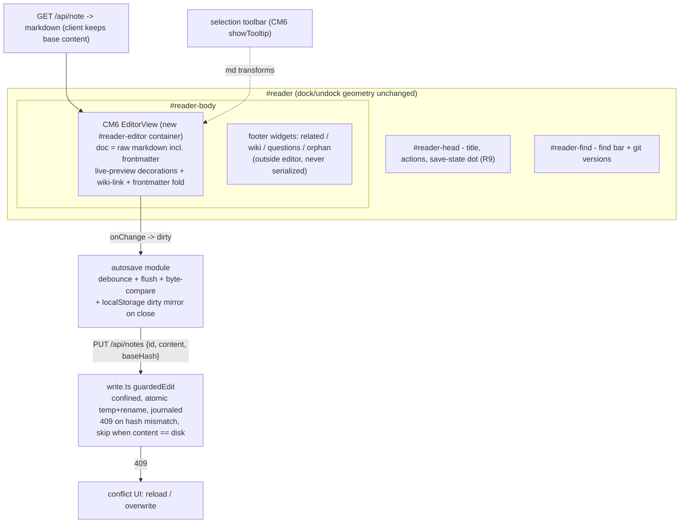
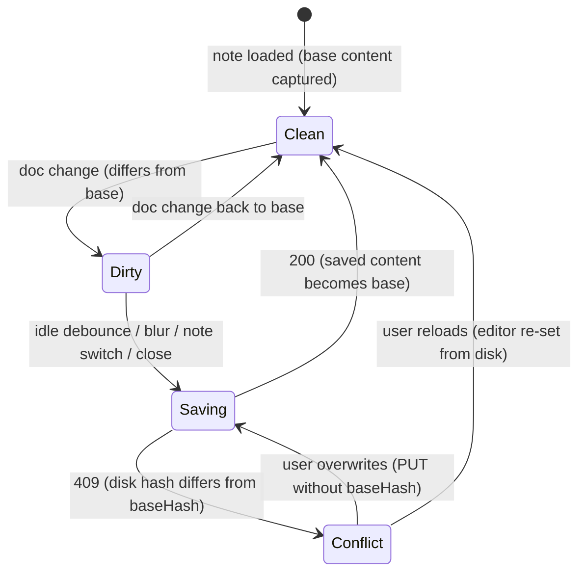

# Always-Editable Reader with Live Markdown Preview - Plan

## Goal Capsule

- **Objective:** Make the reader pane's note content always editable in place — Obsidian-live-preview style (rendered look, markdown transforms live), floating toolbar on selection, debounced autosave into the vault through the existing guarded write path.
- **Authority:** This plan > repo AGENTS.md conventions > implementer judgment on details the plan leaves open. The vault trust model (single write path via `server/integrations/write.ts`, journaled, token-guarded) is non-negotiable.
- **Stop conditions:** Stop and surface if (a) the chosen editor stack cannot pass the byte-for-byte round-trip fixtures in U1, (b) preserving DOMPurify/trust-model guarantees would require a second vault write path, or (c) scope grows into note creation/rename/move.
- **Execution profile:** Six units, dependency-ordered; U1 is a validation gate for the library choice before any integration work.
- **Tail ownership:** Implementer runs the full Verification Contract and updates `AGENTS.md` (reader/editor sections) before done.

---

## Product Contract

### Summary

Replace the reader pane's static rendered note body with a CodeMirror 6 live-preview editor: the note keeps its current rendered look, is always editable (no edit button), shows a floating formatting toolbar on selection, and autosaves through `PUT /api/notes` → `guardedEdit` with a staleness guard. Untouched content round-trips byte-for-byte.

### Problem Frame

The reader is read-only: notes render via `marked` + DOMPurify into `innerHTML`, so fixing a typo or extending a note means leaving Solaris for Obsidian. The vault write machinery already exists (`guardedEdit`, journaling, token guard, git history) but no UI uses it for editing. The product goal is Obsidian-like live-preview editing inside the visualizer without weakening the vault trust model or corrupting vault files: Solaris writes into the user's real Obsidian vault, so any editor that rewrites untouched markdown is unacceptable.

### Requirements

**Editing experience**

- R1. Note content in the reader is always editable — no edit mode or button; clicking into the text places a cursor and typing edits the note.
- R2. The note preserves its current rendered appearance (themed headings, bold, lists, code, links); markdown syntax is revealed only around the active cursor/selection, and typing markdown syntax (`#`, `**`, `-`, backticks) formats live.
- R3. A floating toolbar appears on text selection (standard bubble behavior) with at least bold, italic, headings H1–H4, list, link, and inline code; actions apply markdown edits to the source.
- R3b. The toolbar row also carries a bot icon with an inline text input (same row as the formatting tools) for free-form instructions to the thinker-tier LLM. The request carries positional context: note path/title, the selected text, its surrounding lines, and the selection offsets. The response opens as a preview bubble with Replace / Insert below / Dismiss — nothing touches the note until the user accepts, and an accepted action lands as one undoable edit. The control renders only when an LLM key is configured.
- R4. `[[wiki-links]]` render as links and navigate on click when the cursor is elsewhere; they show editable syntax when the cursor enters them.
- R5. YAML frontmatter is preserved byte-for-byte and stays visually hidden or folded, matching today's behavior of not showing it.

**Persistence**

- R6. Edits autosave through `PUT /api/notes` → `guardedEdit`: debounced on typing pause, flushed on blur, note switch, and window close; every save is journaled and carries the session token.
- R7. Round-trip integrity: opening a note and saving without edits never changes the file on disk; unedited regions of an edited note are never rewritten.
- R8. If the note changed on disk since it was loaded (external edit, git sync/restore, or another in-app writer such as voice promote, wiki-ingest apply, or MCP edit), autosave must not silently clobber it — the UI warns and offers reload or overwrite. Discovery is save-time (the conflicting save is rejected), not live change detection.
- R9. A subtle save-state indicator shows dirty/saving/saved, distinct from the existing git working-tree indicator.

**Coexistence with existing features**

- R10. Footer widgets (related notes, wiki suggestions, note questions, orphan links) sit outside the editable region and are never serialized into the note.
- R11. Passage highlight (semantic-hit snippet) and find-in-note keep working on the editable body.
- R12. Text-selection-to-context keeps working for selections inside the editor.
- R13. Read-only cases degrade to the current rendered view: phantom notes and the non-reader render surfaces (research column, working-document preview) are unchanged.

### Scope Boundaries

- Note creation, rename, move, and delete from the editor — out (existing flows cover creation; rename/move is separate work).
- Image/attachment paste handling — out; plain markdown text editing only.
- Collaborative or multi-window concurrent editing — out; the staleness guard (R8) is the only concurrency handling.
- Mobile editing polish — out; the editor must not break the mobile layout but gets no mobile-specific work.

#### Deferred to Follow-Up Work

- Slash-command or cursor-context insert menu (beyond the selection toolbar).
- Editing inside the research column or working-document views.
- Autosave-triggered incremental rescan (graph updates on save); `/api/rescan` stays manual.

### Acceptance Examples

- AE1. **Given** an open note with frontmatter and `[[wiki-links]]`, **when** the user clicks mid-paragraph and types a word, waits for autosave, then diffs the file on disk, **then** only the typed word differs; frontmatter, links, and blank-line structure are byte-identical.
- AE2. **Given** an open note, **when** the file is modified externally (e.g., Obsidian or git sync) and the user then types, **then** the app surfaces a conflict warning and does not overwrite until the user chooses reload or overwrite.
- AE3. **Given** the user selects a phrase, **when** the selection completes, **then** a floating toolbar appears near the selection; clicking Bold wraps the phrase in `**` and the phrase renders bold.
- AE4. **Given** a semantic search hit opened from the research column, **when** the note opens, **then** the matched passage is highlighted and the note is still editable.

---

## Planning Contract

### Key Technical Decisions

- **KTD1 — CodeMirror 6 live-preview architecture, not an AST/WYSIWYG editor.** The document of record is the raw markdown string; the rendered look is view-only decorations (Obsidian's own architecture). AST-based editors (Milkdown, Tiptap, Lexical, ToastUI) parse markdown into a tree and regenerate the whole file on save, with documented corruption of untouched content: Milkdown mangles frontmatter fences (`---` → `***`) and escapes wiki-links; Tiptap's markdown round-trip is lossy by design (wontfix); Lexical merges blocks. For an app writing into a real vault this is disqualifying; CM6 makes R7 structurally free instead of a multi-year serializer fight (see GitLab's source-mapping epic).
- **KTD2 — Assemble from `@codemirror/*` + `@codemirror/lang-markdown` with an existing live-preview extension set; validate before committing.** Primary candidate: `@atomic-editor/editor`'s individually exported vanilla extensions (inline preview, wiki-links with async resolution and click-to-open, CSS-variable theming; MIT, 2026-active). Fallbacks in order: `@silkdown/core` (framework-agnostic factory), `codemirror-live-markdown` (pure modular CM6), or an in-house decoration plugin following the documented CM6 hide-syntax pattern. These are small, young libraries, so U1 gates the choice with round-trip and integration fixtures before any reader wiring; vendoring the extension code is acceptable if packaging disappoints.
- **KTD3 — The editor document is the full raw file, frontmatter included, with the frontmatter block folded/dimmed by a decoration.** Today `openReader()` strips frontmatter with a regex and discards it; keeping it in the document removes the strip/re-prepend seam and makes R5 automatic. The current title-injection step (`ensureReaderTitle`) becomes display-only (rendered outside the editor or as a decoration) — never inserted into the document.
- **KTD4 — Autosave: debounced on idle (~1.5–2s), flushed on blur/note-switch, suppressed when content equals the base.** Client-side byte-compare suppression satisfies the "no-edit save never touches disk" half of R7. The server additionally skips both the write and the journal entry when incoming content equals disk — this avoids needless writes that would trip other clients' staleness checks, and bounds `data/changes.jsonl` growth (audit-only; entries carry no content, so the journal is never a recovery source).
- **KTD4b — Unload safety: the dirty buffer, not the network, is the recovery net.** `beforeunload` cancels in-flight fetch; `keepalive` PUTs cap the body at 64KB; Electron can tear down the renderer mid-save. Posture: flush async on blur and note-switch (page alive, normal PUT); on window close attempt a `keepalive` PUT *and* mirror the dirty content to `localStorage` (an `akasha-*` key via `prefs.ts`), offering restore on next open of that note. Accept that a >64KB unload flush may only survive via the local mirror.
- **KTD5 — Staleness guard via optional content-hash compare-and-swap on the existing route.** The client tracks a base (the content last loaded or successfully saved); `PUT /api/notes` accepts an optional `baseHash` and returns `409` when the hash of the current on-disk content differs. On 200 the client promotes the saved content to base — no server round-trip of mtimes, so sequential autosaves never self-conflict. Content-hash was chosen over `mtimeMs` because mtime has two false-negative windows (same-millisecond external writes; mtime-preserving tools like `rsync -a` or restores writing older content). Implemented inside `write.ts`/`app.ts` — a guard within the single sanctioned writer, not a new write path; omitted `baseHash` preserves current unconditional behavior for existing callers (voice working-doc promote, wiki-ingest apply, MCP edit, git restore), which bypass the guard by design. Git note-versions remain the recovery net for anything the guard misses.
- **KTD5b — Atomic writes: temp-file-then-rename in `guardedEdit`, symlink-aware.** Plain `writeFileSync` truncates then writes; under frequent autosave a crash or concurrent reader (Obsidian's watcher, git) can observe a truncated note. Write to a temp file in the same directory and rename over the target. Caveat handled explicitly: `rename` onto a symlinked note would replace the symlink with a regular file — realpath the note file first and rename onto the real target (the existing `confine()` only realpaths the parent directory).
- **KTD6 — `marked` + DOMPurify render path stays for every non-editor surface.** The research column, working-document preview, and any phantom/read-only fallback keep the sanitized `innerHTML` path untouched. Inside the editor, note content is never assigned via `innerHTML` — CM6 renders text and decorations — so HTML embedded in a note appears as inert source text, which is at least as safe as the current sanitizer.
- **KTD7 — New logic lives in tested pure-ish modules, not `main.ts`.** Editor factory, serialization fixtures, autosave state machine, and toolbar go into new `web/src/` modules with Vitest coverage, mirroring the `selection-context.ts`/`api.ts` convention; `main.ts` gets only the mounting/wiring.

### High-Level Technical Design

Reader composition and data flow:

Autosave lifecycle:

Directional guidance, not implementation specification — the prose and per-unit fields are authoritative.

### Sequencing

U1 (editor core, library gate) → U2 (reader integration) → U3 (autosave + conflict) and U4 (toolbar) in either order → U7 (AI selection edit, after U4) and U5 (feature reconciliation) → U6 (E2E). U1 is deliberately first and isolated: if no candidate library passes the fixtures, the fallback decision (in-house decorations) happens before any reader surgery. The U4 toolbar row is prototyped via `harness-preview` before U4/U7 implementation.

---

## Implementation Units

### U1. Editor core module with round-trip gate

- **Goal:** A framework-free CM6 markdown live-preview editor factory whose document round-trips byte-for-byte, proving the KTD2 library choice before integration.
- **Requirements:** R1, R2, R4, R5, R7 (round-trip half).
- **Dependencies:** none.
- **Files:** `web/src/editor.ts`, `web/src/editor.test.ts`, `web/src/editor-fixtures/` (real vault-shaped `.md` fixtures), `package.json`.
- **Approach:** Export a factory (`createNoteEditor(parent, opts)`) wrapping `EditorView` with: markdown language support, live-preview/hide-syntax decorations, wiki-link decoration with a click callback (navigation stays the caller's job), frontmatter fold decoration, theme bridge reading the existing CSS variables (`--fg`, `--accent`, `--border`), and a minimal API — `getContent()`, `setContent()`, `onChange`, `destroy()`, read-only toggle. Start from `@atomic-editor/editor`'s exported extensions; drop to fallbacks per KTD2 if vanilla assembly or fixtures fail. Fixture-driven: load fixture → `setContent` → `getContent` → assert byte equality.
- **Patterns to follow:** pure-module + Vitest convention of `web/src/selection-context.ts` / `web/src/api.ts`; theming via CSS-variable sets in `web/src/theme.ts`.
- **Test scenarios:**
  - Round-trip byte equality for fixtures covering: YAML frontmatter, `[[wiki-links]]` (incl. aliased `[[target|alias]]`), task lists, nested lists, code fences with language tags, embedded raw HTML, consecutive blank lines, trailing whitespace/newline, CRLF-free content, unicode/accented text.
  - Typing `# ` at line start yields a styled heading; the syntax markers reveal when the cursor is on that line (assert via decoration state, not pixels).
  - Wiki-link click callback fires with the link target; callback does not fire while the cursor is inside the link.
  - Frontmatter block is folded/dimmed on load and expands when the cursor enters it; content unchanged either way.
  - `destroy()` detaches all DOM and listeners (mount/unmount twice, no duplicate nodes).
- **Verification:** `npm test` green including new fixtures; a scratch HTML harness or Vitest jsdom confirms the factory mounts without the app. If no candidate passes round-trip fixtures, stop and surface (Goal Capsule stop condition) with findings.

### U2. Reader integration

- **Goal:** The reader pane mounts the U1 editor for note content, preserving the current look, geometry, widgets, and read-only fallbacks.
- **Requirements:** R1, R2, R4, R5, R10, R13.
- **Dependencies:** U1.
- **Files:** `web/src/main.ts` (`openReader` and note-switch path), `web/index.html` (`#reader-body` inner structure), `web/src/style.css` (editor container + look parity), `web/src/editor.ts` (adjustments surfaced by integration).
- **Approach:** Add a dedicated editable container inside `#reader-body`; footer widget slots stay siblings outside it. `openReader()` passes the full raw markdown (stop stripping frontmatter; keep the strip only for read-only fallback rendering). Note title display honors `ensureReaderTitle` visually without mutating the document. Wiki-link clicks route to the existing open-note handler; phantom targets keep current behavior. Phantom notes and error states render via the existing sanitized path with the editor read-only or absent. Tear down the editor instance on note switch and reader close. Match typography/spacing of the current `#reader-body` styles so the swap is visually silent.
- **Patterns to follow:** existing `openReader()` flow and reader geometry rules (dock/undock untouched); DOMPurify stays on every remaining `innerHTML` path.
- **Test scenarios:**
  - Covers AE1 (visual/structural half). Opening a note shows rendered content with no visible frontmatter; the file's markdown is retrievable unmodified via `getContent()`.
  - Wiki-link click in the mounted reader opens the target note; phantom link keeps current phantom behavior.
  - Footer widgets render below the editor and their text never appears in `getContent()`.
  - Switching notes twice leaks no editor DOM (single `.cm-editor` present).
  - Phantom note opens read-only with current rendering, no console errors.
  - DOM-behavior checks that Vitest can't cover go to U6 E2E and a manual `npm run dev` pass.
- **Verification:** `npm test` + `npm run typecheck` green; manual dev-server check confirms look parity across at least two themes.

### U3. Autosave, save-state, and staleness guard

- **Goal:** Debounced, journaled, conflict-safe persistence of editor changes.
- **Requirements:** R6, R7 (no-op suppression half), R8, R9.
- **Dependencies:** U2.
- **Files:** `web/src/autosave.ts`, `web/src/autosave.test.ts`, `web/src/main.ts` (wiring + indicator), `web/src/api.ts` (only if a helper is needed), `web/src/prefs.ts` (dirty-mirror key), `server/app.ts` (`PUT /api/notes` baseHash + 409), `server/integrations/write.ts` (hash CAS + atomic temp-rename + equal-content skip in `guardedEdit`), `server/app.test.ts`, `server/integrations/write.test.ts`, `web/index.html` + `web/src/style.css` (save-state indicator).
- **Approach:** `autosave.ts` owns the state machine from the HTD diagram: base content captured at load, dirty on divergence, debounce on idle, flush on blur/note-switch, byte-compare suppression; on 200 the saved content becomes the new base. Saves go through `api()` with explicit `method: "PUT"` (auto-attaches `x-solaris-token`). Unload safety per KTD4b: `keepalive` PUT attempt plus `localStorage` dirty mirror via `prefs.ts`, with restore-on-next-open. Server per KTD5/KTD5b: `guardedEdit` gains optional `baseHash` (409 on mismatch), skips write+journal when incoming content equals disk, and writes atomically via symlink-aware temp+rename. Existing callers pass no `baseHash` and are unaffected. Conflict UI offers reload (re-set editor from disk) or overwrite (retry without `baseHash`). New dirty flag named distinctly (e.g., `editorDirty`) — `readerNoteDirty` already means git-working-tree state.
- **Execution note:** Extend `server/integrations/write.test.ts` with the CAS cases before touching `guardedEdit` — the write path is trust-model-critical and its tests are release-blocking.
- **Test scenarios:**
  - Covers AE2. Save with stale `baseHash` → 409, file unchanged on disk; retry without `baseHash` overwrites; matching `baseHash` → 200 and journal entry with `action:"edit"`, `actor:"user"`.
  - Two sequential debounced edits both return 200 — no self-inflicted conflict after a successful save (base promotion works).
  - Unchanged content triggers no PUT (spy on fetch); a single typed character followed by idle triggers exactly one PUT (debounce collapses bursts); server-side: PUT whose content equals disk returns 200 without a journal entry or mtime bump.
  - Flush on note switch saves pending changes before the new note loads; flush on blur saves.
  - Unload safety: dirty content is mirrored to the `prefs.ts` key on close; reopening that note with a mirror present offers restore; mirror cleared on successful save.
  - Atomicity: `guardedEdit` writes via temp+rename (no truncated intermediate observable); editing a symlinked note preserves the symlink and writes through to the real target.
  - 403 path: token retry behavior of `api()` still applies (one retry then error surfaced, editor stays dirty).
  - `guardedEdit` regression: traversal rejection, `.md`-only, 404-on-missing all still green with the new optional param.
  - Indicator transitions dirty → saving → saved; failure state visible, not silent.
- **Verification:** `npm test` green including `write.test.ts` and `app.test.ts` trust-model negatives; manual check that `data/changes.jsonl` grows by one entry per debounced save.

### U4. Floating selection toolbar

- **Goal:** A themed bubble toolbar on text selection applying markdown formatting.
- **Requirements:** R3.
- **Dependencies:** U1 (extension), U2 (visible in reader).
- **Files:** `web/src/editor-toolbar.ts`, `web/src/editor-toolbar.test.ts`, `web/src/style.css`.
- **Approach:** CM6 `showTooltip` facet driven by a `StateField` on non-empty selections (the documented CodeMirror tooltip pattern — no library ships this; it's ~small custom code). Buttons: bold, italic, heading cycle H1–H4, bullet list, link, inline code — each a dispatch of a markdown text transform on the selection (wrap/unwrap toggling, so bolding bold text unbolds). The row layout reserves a slot for the AI input (U7) so adding it does not reflow the tools. Hide while typing; position above selection with viewport flipping handled by CM6's tooltip options. Style with theme CSS variables.
- **Execution note:** Mock the full toolbar row (all formatting tools + bot icon + inline text input) as a static HTML prototype via `harness-preview` before implementation — the row is chrome-dense and the input needs a width strategy worth seeing first.
- **Patterns to follow:** menubar/dropdown styling in `web/src/style.css`; theme variables from `theme.ts`.
- **Test scenarios:**
  - Transform functions (pure): wrap selection in `**`; unwrap when already bold; heading cycle `none → # → ## → ### → #### → none` on the selection's line; list toggle prefixes/removes `- `; link wraps as `[sel]()` with cursor in the parens; inline code toggles backticks.
  - Toolbar tooltip appears for non-empty selection, absent for bare cursor, disappears on selection collapse (assert via CM6 state/tooltip presence in jsdom).
  - Multi-line selection: bold applies per the transform contract without corrupting line structure.
- **Verification:** `npm test` green; manual dev check for positioning near viewport edges and both docked/floating reader.

### U5. Feature reconciliation (highlight, find, selection-context, git versions)

- **Goal:** Existing reader features work on the editable body instead of silently breaking.
- **Requirements:** R11, R12, plus git-restore interplay with R8.
- **Dependencies:** U2 (and U3 for the restore/conflict interplay).
- **Files:** `web/src/main.ts` (`highlightPassage`, find-in-note, `loadNoteVersions` wiring), `web/src/editor.ts` (highlight/search hooks), `web/src/selection-context.ts` (only if selector assumptions break).
- **Approach:** Passage highlight and find-in-note currently build DOM `Range`s over the rendered article and paint via the CSS Custom Highlight API — those ranges die inside CM6. Reimplement both over the editor: locate the snippet in the markdown source (reuse the existing normalization approach) and paint via CM6 decorations or its search machinery; scroll-to-match via CM6's scroll API. Selection-to-context listens to document `selectionchange` scoped to `#reader-body`; verify it captures selections inside `.cm-content` and adjust the scoping if needed. Git version restore writes through `guardedEdit` server-side: after restore, reload the editor base (else the next autosave 409s against its own restore) — treat restore as an external change that refreshes the base content.
- **Test scenarios:**
  - Covers AE4. Opening a note with a highlight snippet marks the matching source range and scrolls it into view; no-match degrades silently (current behavior).
  - Find-in-note: matches counted and navigable in an editable note; typing invalidates and re-runs the search without console errors.
  - Selection inside the editor produces the same selection-context payload fields as before (pure-module test on the adjusted scoping).
  - After a version restore, editor shows restored content and next edit autosaves without a conflict prompt.
- **Verification:** `npm test` green; manual dev pass: semantic-hit open, find bar, selection-to-context chip, version restore.

### U7. AI assist from the toolbar (thinker tier)

- **Goal:** The toolbar's bot input sends a free-form instruction plus positional note context to the thinker-tier LLM and previews the response for accept/dismiss.
- **Requirements:** R3b.
- **Dependencies:** U4.
- **Files:** `web/src/editor-toolbar.ts` (input UI, preview bubble, dispatch), `web/src/editor-toolbar.test.ts`, `server/integrations/registry.ts` (new `selection_assist` operation, thinker tier, `http` surface), `server/app.ts` (token-guarded route), `server/app.test.ts` (resolve the model via `llm.ts` `resolveTier`, never the adapter directly).
- **Approach:** New registry-declared operation (`selection_assist`), thinker tier (degrades thinker → worker per `llm.ts`). Request envelope: instruction, note path + title, selected text, a bounded window of surrounding lines, and selection offsets — enough for the model to know where in the note it is acting; response is the assistant text. Route follows the existing LLM-gate pattern (`gates.ts` key check); the toolbar input hides when the gate reports no key, mirroring other LLM features. Frontend: submit on Enter, in-flight state on the bot icon, response opens as a preview bubble anchored to the toolbar with Replace / Insert below / Dismiss; Replace and Insert dispatch one CM6 transaction (single undo step) and then persist through normal autosave. Dismiss discards without touching the note.
- **Patterns to follow:** registry operation declarations in `server/integrations/registry.ts` and thinker-tier resolution via `llm.ts` (like wiki-ingest synthesis and voice delegation); route gating via `gates.ts`.
- **Test scenarios:**
  - Route: missing key → gated response per existing LLM-gate convention; with key (mocked adapter) the request envelope carries instruction, note id/title, selection, window, and offsets; token required (403 without).
  - Frontend (mocked fetch): Enter dispatches with the full context envelope; preview bubble renders the response without mutating the editor; Replace swaps the selection in one transaction (one undo restores); Insert below adds after the selection's line in one transaction; Dismiss leaves the document byte-identical.
  - In-flight state clears on response and on error; error surfaces non-silently and the note is untouched.
  - Input hidden when the LLM gate reports no key.
- **Verification:** `npm test` green; manual dev check with a configured key: ask a question (dismiss) and request a rewrite (replace) on a real note.

### U6. End-to-end proof and diagnostics

- **Goal:** Playwright proof of the full edit→save→disk loop under the release-blocking browser-diagnostics harness.
- **Requirements:** AE1–AE4 end-to-end; R6–R8 against a real filesystem.
- **Dependencies:** U2–U5 (U7's AI path is covered by unit tests with a mocked adapter, not E2E — no live LLM in the E2E suite).
- **Files:** `tests/e2e/editable-reader.test.ts` (new), fixture vault under the E2E setup the existing smoke tests use.
- **Approach:** Drive the dev server against a temp vault: open note → type → await autosave → assert file content on disk changed only where typed (AE1, byte-level diff). Externally rewrite the file → type → assert conflict UI and no clobber (AE2). Select text → toolbar appears → bold applies (AE3). Diagnostics harness must stay clean (no unallowlisted `console.error`, `pageerror`, `requestfailed`, HTTP ≥ 500) and keep writing `test-results/browser-diagnostics.json`.
- **Test scenarios:** the four acceptance examples above, plus: reload after save shows persisted content; rapid typing then immediate reader close does not lose the pending save (flush-on-close).
- **Verification:** `npm run test:e2e` green locally.

---

## Verification Contract

| Gate | Command | Proves |
|---|---|---|
| Unit + integration | `npm test` | Round-trip fixtures (U1), autosave state machine (U3), toolbar transforms (U4), reconciled helpers (U5), server CAS + trust-model negatives (`server/app.test.ts`, `server/integrations/write.test.ts`) |
| Types | `npm run typecheck` | New modules and server param changes compile |
| E2E + diagnostics | `npm run test:e2e` | AE1–AE4 live, browser diagnostics clean (release-blocking) |
| Manual | `npm run dev` | Look parity across themes, toolbar positioning, dock/float geometry, conflict UI — DOM behavior Vitest can't cover |

Trust-model negatives (path traversal, token enforcement on `PUT /api/notes`, `.md`-only) are release-blocking; any red here blocks done regardless of feature state.

## Definition of Done

- All seven units implemented; every Verification Contract gate green.
- AE1 byte-diff proof exists as a passing E2E assertion, not a manual claim.
- No second vault write path introduced; `write.ts` diff limited to `guardedEdit` hardening (hash CAS, equal-content skip, atomic temp+rename).
- `AGENTS.md` reader/editor and write-path sections updated to describe the editable reader and the `baseHash` guard.
- Abandoned experiments (rejected editor libs, scratch harnesses) removed from the diff; new dependencies limited to the CM6 stack chosen in U1.
- Follow-up learning captured in `docs/solutions/` (editor-architecture choice + round-trip gate) per repo convention.

---

## Risks & Dependencies

- **Candidate libraries are young/small** (`@atomic-editor/editor` ~107★, `@silkdown/core` 2026-new). Mitigated by the U1 gate, the in-house-decorations fallback (the CM6 pattern is documented and small), and vendoring as a last resort. CM6 itself (`@codemirror/*`) is mature and battle-tested.
- **CM6 peer-dependency duplication** (`@codemirror/state` singletons) breaks editors silently when deduped wrong — pin/dedupe in `package.json` and assert a single instance in U1 tests.
- **Live-preview fidelity vs. current `marked` rendering** may differ on edge constructs (tables, footnotes). Acceptable drift if readable; U2 manual pass judges parity, and read-only surfaces keep `marked` so nothing else shifts.
- **`main.ts` is a 6400-line monolith** — integration touches are kept to mounting/wiring per KTD7 to bound regression surface.
- **Journal growth** from autosave is bounded by debounce, client byte-compare suppression, and the server-side equal-content skip (KTD4); the journal is audit-only (entries carry no content) — recovery is git note-versions plus the unload dirty mirror.
- **Save-time-only conflict discovery** (R8): other in-app writers legitimately bypass the CAS, and the open editor learns of divergence only when its next flush 409s. Accepted; live change detection is out of scope.
- **Graph staleness after edits**: the 3D node's title/links reflect the last scan, not the just-saved content, until a manual rescan — already deferred (autosave-triggered rescan is follow-up work).

## Sources & Research

- Repo grounding: `web/src/main.ts` (`openReader` 1671–1780, `highlightPassage` 1595–1669, find 2028–2163, dock 2247+), `web/index.html:386-424`, `server/app.ts` (`PUT /api/notes` 1514–1526, `GET /api/note` 2115, restore 1978), `server/integrations/write.ts` (`guardedEdit` 171–188), `web/src/api.ts` (token attach, PUT must be explicit).
- Round-trip lossiness evidence (disqualifying AST editors): Milkdown/vscode#33 + milkdown#1712/#2379 (frontmatter/HTML corruption), ueberdosis/tiptap#7147 (wontfix lossy round-trip) + #7731, facebook/lexical#6431, ckeditor5#16834, GitLab work_items/7256 (multi-year preserve-markdown epic).
- CM6 live-preview prior art: github.com/kenforthewin/atomic-editor, github.com/magarcia/silkdown, github.com/conql/codemirror-live-markdown, codemirror.net/examples/tooltip (selection toolbar primitive), discuss.codemirror.net/t/7602 (hide-syntax pattern).
